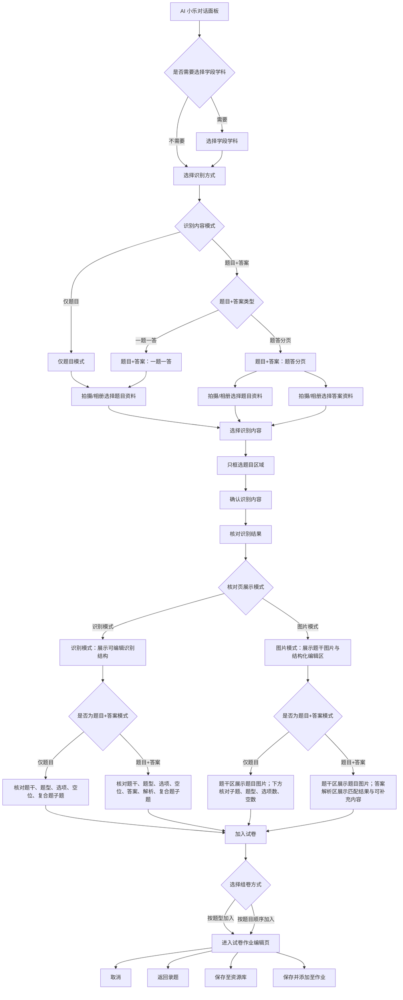

# Pad端作业资料识别完整需求

## 1. 文档说明

本文档用于给后续开发或 AI 开发提供 Pad 端作业资料识别流程的完整需求视角。文档基于 `01-小乐对话面板.md`、`02-选择识别方式.md`、`03-拍摄页面.md`、`04-选择识别内容.md`、`05-核对识别结果.md` 中已经整理过的页面业务逻辑，并同步使用页面数字角标悬浮面板中已核对修订后的注释内容。

本文档关注前端页面展示、用户交互、跨页面数据流转、模式关系和边界场景。不覆盖题目识别、答案识别、解析生成等内部 AI 模型推理逻辑；只要求前端交互效果、状态呈现和数据承接关系符合当前原型和已确认规则。

本文档不单独设置验收标准章节；如需逐条验收，可回到单页 PRD 或页面数字角标查看对应对象。

## 2. 整体业务目标

Pad 端作业资料识别流程的目标，是让用户从 AI 小乐对话面板发起作业资料识别任务，完成识别方式选择、资料拍摄或相册选择、题目区域确认、识别结果核对，并把确认后的题目结构加入试卷或进入后续录题页面。

完整流程需要支持仅题目模式和题目+答案模式。题目+答案模式继续区分一题一答和题答分页；其中题答分页下，题目资料和答案资料需要分别拍摄或分别从相册选择。

## 3. 整体流程图

## 4. 完整流程总览

### 4.1 AI 小乐发起流程

用户在 AI 小乐对话面板点击“帮我识别作业资料”后，系统进入 Pad 端作业资料识别流程。若当前账号存在多个可用学段学科，先要求用户选择本次识别资料所属的学段学科；若无需选择，则直接进入选择识别方式页面。该入口不在对话区追加用户消息或 AI 回复气泡。

### 4.2 选择识别方式

选择识别方式用于确定本次识别内容模式。仅题目模式表示后续只识别和核对题目结构；题目+答案模式表示后续除题目结构外，还需要承接答案和解析的匹配、回填与人工补充。题目+答案模式继续分为一题一答和题答分页：一题一答下题目与答案解析在同一份资料里组织；题答分页下题目资料和答案资料分开采集、分开管理。

### 4.3 拍摄或相册选择资料

所有模式的资料来源都支持拍摄和相册选择。仅题目模式和一题一答模式主要采集题目资料；题答分页模式需要分别采集题目资料和答案资料，拍摄入口、相册选择、图片管理和继续识别都需要带上当前资料分类。

### 4.4 选择识别内容

选择识别内容页面只处理题目区域确认。无论当前是仅题目、一题一答还是题答分页，本页面都只框选题目区域，不框选答案或解析区域。答案资料在后续识别和核对阶段用于答案解析匹配，不在本页面作为可框选对象维护。

### 4.5 核对识别结果

核对识别结果页同时存在顶层识别模式/图片模式，以及每张题卡自己的识别/图片切换。识别模式侧重展示和编辑结构化识别结果；图片模式侧重展示题目图片或截图，同时保留必要的结构化核对能力。题目+答案模式下，图片模式需要区分题干区和答案解析区：题干区展示题目图片并承载题型、选项数、空数、子题结构等核对操作；答案解析区展示答案/解析匹配结果、未匹配状态、人工补充入口和回填内容。

### 4.6 加入试卷和返回录题

用户点击加入试卷后，系统先根据当前题目、答案、解析和子题结构进行前端校验。需要用户确认组卷方式时，展示加入试卷弹窗，支持按题型加入试卷或按题目顺序加入试卷。确认后进入试卷作业编辑页，底部提供取消、返回录题、保存至资源库、保存并添加至作业等操作。

## 5. 核心模式关系

### 5.1 仅题目模式

仅题目模式只要求用户核对题干、题型、选项、空位和复合题子题结构。该模式不展示答案解析匹配模块，也不要求处理答案和解析回填。

### 5.2 题目+答案模式

题目+答案模式在题目结构核对之外，增加答案和解析的匹配、未匹配提示、人工关联、人工补充和回填内容。该模式下的核对页需要同时处理父题答案、父题解析、空位答案、子题答案、子题解析等对象。

### 5.3 一题一答

一题一答是题目+答案模式的一种资料组织方式，题目、答案和解析通常来自同一组资料。前端流程仍支持拍摄和相册选择资料，并在后续核对页按题目维度承接答案解析匹配结果。

### 5.4 题答分页

题答分页是题目+答案模式的另一种资料组织方式。题目资料和答案资料需要分开拍摄或分开从相册选择；进入选择识别内容时仍只框选题目资料里的题目区域，答案资料不进入题目框选操作。

### 5.5 识别模式

识别模式展示结构化识别结果，并允许用户对题干、题型、选项、空位、答案、解析和子题结构进行编辑或补充。若图片内容发生更新，切回识别模式时需要重新识别；若图片没有更新，则回显用户之前编辑过的识别结果。

### 5.6 图片模式

图片模式展示题目图片或截图，并保留与图片内容相关的裁剪、单题视图切换和结构核对能力。仅题目模式下，图片模式主要核对题目图片、题型、选项数、空数和复合题子题；题目+答案模式下，图片模式还需要展示答案解析区的匹配结果和补充入口。

## 6. 跨页面数据流转

### 6.1 学段学科

学段学科来自当前用户账号可用范围。若账号存在多个可用学段学科，用户从 AI 小乐对话面板发起识别后需要先选择本次识别的学段学科；选择结果继续传递给识别方式、资料采集、识别内容选择和识别结果核对。

### 6.2 识别内容模式和资料组织方式

用户在选择识别方式页面确定仅题目或题目+答案。若选择题目+答案，还需要确定一题一答或题答分页。该模式决定拍摄页面是否需要区分题目资料和答案资料，也决定核对结果页是否展示答案解析匹配模块。

### 6.3 资料图片和资料页

拍摄页面产生资料图片列表。用户可以通过拍照、相册选择、补拍、重拍、删除、排序或移动维护资料顺序。题答分页下，每张资料图片需要归属到题目资料或答案资料。

### 6.4 题目框选区域

选择识别内容页面根据资料页展示自动切题框和人工框选框。用户确认后，题目框选区域进入识别流程。所有模式下，本页面传出的都是题目区域，不传出答案解析框选区域。

### 6.5 题目结构

识别流程产出题目结构，包括题干、题型、选项、填空空位、复合题父题和子题。核对页允许用户继续修正这些结构；用户手动新增的空位、选项数或子题按页面原型已实现的交互效果执行。

### 6.6 答案和解析

题目+答案模式下，答案和解析在核对页进入匹配、回填和人工补充流程。答案解析可以和题目自动匹配，也可以通过人工关联图标、画框和补充操作回填到右侧对应题干、父题答案解析、空位答案或子题答案解析区域。

### 6.7 加入试卷输出

加入试卷时，系统输出用户确认后的题目结构、题型、选项、空位、复合题子题、答案和解析。进入试卷作业编辑页后，用户可取消、返回录题、保存至资源库或保存并添加至作业。

## 7. 页面级需求说明

### 7.1 小乐对话面板

页面目标：作为 Pad 端作业资料识别的入口，用户从 AI 小乐对话面板发起“识别作业资料”流程，并在需要时先确认本次识别的学段学科。

#### 页面业务逻辑

#### 1. 识别作业资料入口

需求编号：TABLET_AI_CHAT_RECOGNIZE-001
来源：代码事实 + 确认决策
页面对象：帮我识别作业资料
页面锚点：tablet-ai-chat.recognize-homework-button

##### 显示说明
1. AI 小乐对话面板的快捷功能区展示「帮我识别作业资料」按钮，与布置试卷作业、布置听力作业并列。
2. 该入口用于启动平板端识别作业资料流程，不在对话区追加用户消息或 AI 回复气泡。

##### 操作说明
1. 用户点击后直接进入学科前置判断，若当前用户是单学段学科用户，则直接进入到选择识别方式的页面；

若当前用户是多学段学科的用户，则继续出现学科选择的对话。
2. 该入口不生成新的对话消息，也不要求用户先在聊天输入框内确认任务。

##### 权限规则
1. 沿用平板端作业入口页的使用权限。

##### 数据流转
1. 点击动作只启动本次识别流程的前置状态，不生成聊天记录数据。

##### 异常处理
1. 如果学科确认或识别方式选择无法继续，页面应停留在当前面板，并允许用户重新点击入口发起流程。

#### 2. 多学科用户学段学科提示

需求编号：TABLET_AI_CHAT_SUBJECT_PROMPT-001
来源：代码事实 + 确认决策
页面对象：请先选择这次识别资料的学段学科
页面锚点：tablet-ai-chat.subject-prompt

##### 提示展示
1. 当前用户存在多个可用学段学科时，点击「帮我识别作业资料」后，AI 小乐面板展示「请先选择这次识别资料的学段学科」提示，引导用户先确认本次识别资料所属学段学科。

##### 学科来源
1. 提示下方展示的学段学科范围，应来自当前用户账号在乐课网下可使用的学段学科信息；
2. 用户只能从该范围内选择本次识别资料对应的学段学科。

##### 权限规则
1. 只展示当前用户账号可使用的学段学科。

##### 数据流转
1. 用户选定的学段学科作为本次作业资料识别的学科信息，继续传递到后续识别方式选择和资料识别流程。

##### 异常处理
1. 如果当前账号没有可用学段学科，也按多学科用户的效果走，但是显示提示文案为——您当前还没有任课学科，请先完善任课学科后，再进行识别操作呢~

#### 3. 底部输入框置灰

需求编号：TABLET_AI_CHAT_INPUT_DISABLED-001
来源：代码事实 + 确认决策
页面对象：AI 小乐底部输入框
页面锚点：tablet-ai-chat.input-disabled

##### 置灰展示
1. AI 小乐对话面板底部输入区展示为置灰状态，输入提示、语音入口、添加入口和发送入口均呈现不可用样式。

##### 不可输入
1. 去掉底部的对话输入框，在没有AI生成的时候，无内容，在有AI生成的时候，底部显示内容正在生成中的加载效果，可以操作暂停。最终样式见UI稿，PC端已实现

##### 数据流转
1. 底部输入区不采集用户输入，也不产生新的对话记录或识别任务。

### 7.2 选择识别方式

页面目标：承接 AI 小乐入口，确定本次识别内容模式和资料组织方式，包括仅题目、题目+答案一题一答、题目+答案题答分页。

#### 页面业务逻辑

#### 1. 标题与返回

需求编号：TABLET_RECOGNITION_MODE-001
来源：代码事实 + 确认决策
页面对象：选择识别方式标题与返回入口
页面锚点：tablet-recognition-mode.header-back

##### 标题展示
1. 页面顶部展示返回入口
标题「选择识别方式」和说明文案「（根据资料内容选择识别方式）」。

##### 返回规则
1. 用户在当前步骤或后续流程中点击返回时，只要还没有上传图片或拍摄图片，就返回至上一步页面。
2. 当前页面返回到 AI 小乐面板时，AI 小乐面板恢复为三个快捷指令状态，不展示学科选择状态。

##### 权限规则
1. 沿用平板端 AI 小乐「帮我识别作业资料」入口的使用范围。

##### 数据流转
1. 未上传或未拍摄资料前返回，不产生识别资料数据；
2. 已选学科不在 AI 小乐面板继续展示，后续重新发起识别时按入口流程重新承接。

##### 异常处理
1. 如果用户已经上传图片或拍摄图片，返回规则不由本页面继续处理，应由上传/拍摄资料环节按其已确认规则承接。

#### 2. 仅识别题目

需求编号：TABLET_RECOGNITION_MODE-002
来源：代码事实 + 确认决策
页面对象：仅识别题目卡片
页面锚点：tablet-recognition-mode.questions-only-card

##### 卡片说明
1. 第一张识别方式卡片展示标题「仅识别题目」和适用场景的说明文案——「适用于只包含题目、不包含答案解析的资料」。
2. 该模式用于用户只需要识别题目内容的资料。

##### 选择规则
1. 用户点击「仅识别题目」卡片后，该识别方式立即生效，并直接进入拍摄/上传资料流程。
2. 即使资料中包含答案解析，用户仍可选择该模式继续处理；
3. 后续流程只识别题目，答案解析不参与处理。

##### 权限规则
1. 沿用平板端 AI 小乐「帮我识别作业资料」入口的使用范围。

##### 数据流转
1. 后续识别结果只保留题目内容。

##### 异常处理
1. 本页面不检查资料是否已经包含答案解析，也不在选模式时拦截用户继续。

#### 3. 一题一答

需求编号：TABLET_RECOGNITION_MODE-003
来源：代码事实 + 确认决策
页面对象：题目+答案（一题一答）卡片
页面锚点：tablet-recognition-mode.same-image-answer-card

##### 卡片说明
1. 第二张识别方式卡片展示标题：「题目+答案」、标签「一题一答」和适用场景的说明文案——「适用于题目与答案解析紧挨着出现的资料」。

##### 选择规则
1. 用户点击「一题一答」卡片后，该识别方式立即生效，并直接进入拍摄/上传资料流程。
2. 该模式只适用于题目和答案解析紧挨着排列的资料。

##### 权限规则
1. 沿用平板端 AI 小乐「帮我识别作业资料」入口的使用范围。

##### 数据流转
1. 后续按题目与答案解析同页相邻的业务口径处理。

##### 异常处理
1. 如果资料中的题目与答案解析分开拍摄或不在同一排列场景中，用户应选择「题答分页」模式。

#### 4. 题答分页

需求编号：TABLET_RECOGNITION_MODE-004
来源：代码事实 + 确认决策
页面对象：题目+答案（题答分页）卡片
页面锚点：tablet-recognition-mode.separate-answer-card

##### 卡片说明
1. 第三张识别方式卡片展示标题「题目+答案」、标签「题答分页」和适用场景的说明文案——「适用于题目与答案解析分开拍摄的资料」。

##### 分类流转
1. 用户点击「题答分页」卡片后，该识别方式立即生效，并直接进入拍摄/上传资料流程。
2. 后续上传/拍摄资料环节使用「题目图片 / 答案图片」分类替代 PC 端文件用途弹窗。

##### 权限规则
1. 沿用平板端 AI 小乐「帮我识别作业资料」入口的使用范围。

##### 数据流转
1. 「题答分页」作为本次识别方式传递给后续拍摄/上传流程；
2. 后续题目图片用于切题和题目识别，答案图片用于答案解析匹配。

##### 异常处理
1. 题目图片和答案图片的最少数量、缺少其中一类资料时的提示文案和拦截方式，不在当前页面判断，需在后续上传/拍摄资料环节继续确认和承接。

### 7.3 拍摄页面

页面目标：根据用户选择的识别方式，支持拍摄或从相册选择资料；题答分页时题目资料和答案资料分开采集与管理。

#### 页面业务逻辑

#### 1. 标题与关闭

需求编号：TABLET_CAPTURE-001
来源：代码事实 + 确认决策
页面对象：拍摄页标题与关闭入口
页面锚点：tablet-capture.header-close

##### 页面状态
1. 拍摄页左上角展示关闭入口。
2. 仅识别题目模式下，页面中心，展示固定文案——拍摄作业资料
3. 题答分页模式下，页面中心，根据当前分类展示「拍摄题目」或「拍摄答案」，并通过顶部分类入口展示题目图片和答案图片数量。

##### 返回规则
1. 用户点击关闭后，直接返回上一页，不区分当前是否已经拍摄或从相册添加图片。

##### 权限规则
1. 仅面向已从 AI 小乐发起识别作业资料流程、并进入拍摄资料页的用户。

##### 数据流转
1. 关闭后清空本次拍摄页内已拍摄和已从相册添加的图片；
2. 用户再次进入拍摄页时，需要重新添加资料。

##### 异常处理
1. 关闭操作不弹出二次确认，也不保留当前拍摄进度。

#### 2. 题答分类

需求编号：TABLET_CAPTURE-002
来源：代码事实 + 确认决策
页面对象：题目图片 / 答案图片分类切换
页面锚点：tablet-capture.role-tabs

##### 分类展示
1. 题答分页模式下，顶部展示「题目图片」和「答案图片」两个分类入口，并分别显示当前已添加数量。
2. 当前选中的分类需要有明确选中状态，让用户知道接下来拍摄或从相册添加的图片会进入哪一类。

默认都定位到题目图片分类

##### 归属规则
1. 用户可以随时在题目图片和答案图片之间切换。
2. 切换后，新拍摄或新从相册添加的图片归入当前选中的分类。

##### 权限规则
1. 仅题答分页模式展示并允许使用该分类切换；

##### 数据流转
1. 题目图片用于后续切题和题目识别，答案图片用于后续答案解析匹配；
2. 两个分类随本次识别任务一起传递到后续流程。

##### 异常处理
1. 切换分类本身不校验数量，也不阻止用户进入空分类查看或继续添加图片。

#### 3. 拍摄示例

需求编号：TABLET_CAPTURE-003
来源：确认决策
页面对象：拍摄示例按钮
页面锚点：tablet-capture.example

##### 示例入口
1. 拍摄页右上角展示「拍摄示例」入口，用于帮助用户查看当前资料应该如何拍摄。

##### 示例查看
1. 用户点击「拍摄示例」后，展示线上已有的拍摄示例效果。

##### 权限规则
1. 进入拍摄资料页后即可查看拍摄示例。

##### 数据流转
1. 查看拍摄示例不改变已拍图片、已选分类和后续识别资料。

##### 异常处理
1. 关闭拍摄示例后，应回到当前拍摄页并保持原有拍摄进度。

#### 4. 相册添加

需求编号：TABLET_CAPTURE-004
来源：代码事实 + 确认决策
页面对象：从相册选择入口
页面锚点：tablet-capture.album

##### 入口规则
1. 拍摄页侧边栏展示从相册选择入口。
2. 平板端拍摄页只支持添加图片资料

##### 添加规则
1. 用户从相册选择图片后，图片加入本次识别资料。
2. 仅识别题目模式下，图片加入作业图片；
3. 题答分页模式下，图片加入当前选中的题目图片或答案图片分类。

##### 权限规则
1. 进入拍摄资料页后即可从相册添加图片。

##### 数据流转
1. 相册图片按添加顺序进入当前任务，越先拍摄或越先添加的图片，展示在越上面
2. 题答分页模式下，题目图片和答案图片合计最多 24 张。

仅题目模式或一题一答的模式下，总计图片24张

##### 异常处理
1. 单次识别最多 24 张图片；
2. 达到上限后，应阻止继续添加新图片。

从相册选择的按钮不可点击，拍摄按钮不可点击，点击后显示toast提示——单次最多识别24张图片

#### 5. 拍照裁剪

需求编号：TABLET_CAPTURE-005
来源：代码事实 + 确认决策
页面对象：拍照按钮与裁剪框
页面锚点：tablet-capture.shutter-crop

##### 裁剪状态
1. 拍摄页展示拍照按钮。
2. 第一次点击后，页面出现可调整的裁剪框；
3. 裁剪框展示在拍摄画面上，用户可以看到本次将生成图片的范围。

##### 生成图片
1. 优选方案为第一次点击拍照后，系统自动框选图片中有内容的区域；
2. 用户可以手动调整框选范围，再次点击确认生成图片。
3. 若自动框选不可用，则第一次点击出现默认裁剪框，用户调整后再次点击确认生成图片。

##### 权限规则
1. 进入拍摄资料页后即可拍摄图片。

##### 数据流转
1. 确认生成后的图片加入当前识别资料；
2. 仅识别题目模式加入作业图片，题答分页模式加入当前选中的题目图片或答案图片。

##### 异常处理
1. 用户未确认裁剪前，不生成新的图片。
2. 自动框选能力不稳定或不可用时，使用默认裁剪框作为兜底。

#### 6. 继续识别

需求编号：TABLET_CAPTURE-006
来源：代码事实 + 确认决策
页面对象：下一步拍答案 / 去切题按钮
页面锚点：tablet-capture.primary-action

##### 按钮状态
1. 正常拍摄流程：
仅识别题目模式展示「去切题」；

题答分页模式-题目阶段展示「下一步：拍答案」，答案阶段展示「去切题」。
2. 补充资料流程：
从选择识别内容页进入补充资料后，按钮内容的显示，和正常拍摄流程保持一致

按钮的点击状态有新规则补充：
如果用户没有新增图片，也没有调整已处理图片顺序，「去切题」保持置灰不可点击；

如果用户新增了图片或调整了已处理图片的顺序，「去切题」恢复可点击。

##### 流转规则
1. 正常拍摄流程：
题答分页模式下，题目阶段已有题目图片后，用户可以点击「下一步：拍答案」进入答案图片拍摄；答案阶段已有答案图片后，用户可以点击「去切题」。仅识别题目和题目答案同图模式下，已有作业图片后，用户可以点击「去切题」。
2. 补充资料流程：
用户新增图片，或只调整已处理图片顺序后，都可以点击「去切题」重新处理资料；用户没有新增图片且没有调整顺序时，不进入重新切题流程。

##### 权限规则
1. 正常拍摄流程：仅当前拍摄阶段已经添加必需资料时允许继续。
2. 补充资料流程：仅本次补充资料存在新增图片或顺序变化时允许继续。

##### 数据流转
1. 正常拍摄流程：
点击「下一步：拍答案」只切换拍摄阶段；点击「去切题」后，按当前已拍资料进入后续选择识别内容流程。
2. 补充资料流程：
点击「去切题」后，后续选择识别内容页按补充资料后的最新图片顺序展示；
如果只新增图片且未调整旧图片顺序，可优先保留旧图片的原切题结果，只处理新增图片；

如果调整了旧图片顺序，或无法保留旧切题结果，则按最新图片顺序重新切题。

##### 异常处理
1. 正常拍摄流程：
缺少题目图片时提示「请先添加题目图片」；缺少答案图片时提示「请先添加答案图片」。
2. 补充资料流程：无新增图片且无排序变化时，「去切题」置灰不可点击，不展示额外提示。

#### 7. 已拍入口

需求编号：TABLET_CAPTURE-007
来源：代码事实 + 确认决策
页面对象：已拍图片入口
页面锚点：tablet-capture.manager-entry

##### 入口状态
1. 拍摄页侧边栏展示已拍图片入口。
2. 没有图片时入口不可用；
3. 已有图片时展示最近添加图片的缩略图，并显示本次已添加的全部图片数量。

##### 打开管理
1. 用户点击已拍图片入口后，打开已拍图片管理面板，用于查看、删除、调整题目图片顺序，或在题答分页模式下调整图片分类。

##### 权限规则
1. 本次拍摄任务已有图片时才允许打开图片管理面板。

##### 数据流转
1. 题答分页模式下，该数量为题目图片和答案图片合计数。

##### 异常处理
1. 没有任何图片时，已拍图片入口保持不可用，不打开图片管理面板。

#### 8. 图片管理

需求编号：TABLET_CAPTURE-008
来源：代码事实 + 确认决策
页面对象：已拍图片管理面板
页面锚点：tablet-capture.manager-panel

##### 分组展示
1. 图片管理面板标题为「已拍图片」。
2. 仅识别题目、一题一答模式下，图片管理面板标题为「已拍图片」
3. 题答分页模式下按「题目」和「答案」分组展示。
4. 每个分组展示当前图片数量，分组为空时展示「暂未添加图片」。

##### 删除规则
1. 用户可以在图片管理面板中删除图片，删除时不需要二次确认。
2. 删除后，页面根据剩余图片重新计算当前分组的图片数量和主操作按钮的图片总数

##### 权限规则
1. 本次拍摄任务已有图片时才允许进入图片管理面板执行管理操作。

##### 数据流转
1. 删除图片后，该图片从本次识别资料中移除，不再传递给后续切题、识别或答案匹配流程。补充资料态下删除本次补充图片后，系统继续按剩余补充图片和当前排序状态判断「去切题」是否可用。

##### 异常处理
1. 首次拍摄时，删除最后一张图片后，已拍图片入口恢复为无图片状态，主操作按钮按无资料规则不可继续。补充资料态下，如果删除所有本次补充图片但已调整过已处理图片顺序，仍允许点击「去切题」重新切题；如果没有新增也没有排序变化，「去切题」保持置灰。

#### 9. 排序与移动

需求编号：TABLET_CAPTURE-009
来源：代码事实 + 确认决策
页面对象：排序 / 移到题目 / 移到答案
页面锚点：tablet-capture.sort-move

##### 操作入口
1. 正常拍摄流程：
图片管理面板中的图片行展示排序入口。

题答分页模式下，题目图片和答案图片分别展示在各自分组内，并提供「移到答案」或「移到题目」入口。
2. 补充资料流程：
在正常拍摄流程的分组显示规则下，图片管理面板同时展示已处理图片和本次补充图片。

已处理图片展示“已处理”标签，本次新增图片展示“本次补充”标签；

两类图片都可以展示排序入口，本次补充图片可删除，已处理图片不展示删除按钮

##### 排序流转
1. 正常拍摄流程：
题答分页模式下，题目图片支持调整顺序，用户可以把题目图片移到答案分组，也可以把答案图片移到题目分组。图片移动后，图片进入目标分组，并参与该分组后续资料处理。
2. 补充资料流程：
仅识别题目、题目答案同图、题答分页三种模式下，用户都可以在图片管理面板中调整已处理图片和本次补充图片的顺序。

用户只调整已处理图片顺序但没有新增图片时，也视为本次资料发生变化。

##### 权限规则
1. 正常拍摄流程：
仅题答分页模式提供题目/答案图片移动；题目图片排序只对题目分组开放。
2. 补充资料流程：
三种识别模式都允许对图片管理面板中的可见图片排序；

已处理图片不可删除，本次补充图片可删除。

##### 数据流转
1. 正常拍摄流程：
移动图片会改变该图片在本次识别任务中的分类；题目图片顺序调整后，后续切题和识别按最新顺序处理。
2. 补充资料流程：
用户点击「去切题」后，系统按补充资料后的最新图片顺序重新进入切题处理；

重新切题时清空旧切题框、手动框和框选状态，再按最新图片顺序生成新的切题框。

##### 异常处理
1. 正常拍摄流程：
移动后如果某一分类为空，面板展示该分类空状态；

进入切题前仍按题目图片和答案图片都要有内容的规则校验。
2. 补充资料流程：
删除全部本次补充图片后，如果已处理图片顺序没有变化，「去切题」置灰；

如果已处理图片顺序已经变化，仍允许点击「去切题」重新处理。

### 7.4 选择识别内容

页面目标：在识别前让用户核对资料页并确认题目区域；无论选择哪种识别内容模式，本页面只框选题目区域。

#### 页面业务逻辑

#### 1. 标题与返回

需求编号：TABLET_QUESTION_CONTENT_SELECTION-001
来源：代码事实 + 确认决策
页面对象：页面标题与返回入口
页面锚点：tablet-question-content-selection.header-back

##### 显示说明
1. 页面顶部展示返回入口和标题「选择识别内容」，用于承接用户已经完成拍摄或上传后的题目内容确认。

##### 返回规则
1. 用户点击返回时，如果当前没有切题框，直接返回上一页；
2. 如果当前已有切题框，需要先提示用户返回后会清空当前框选内容。

用户确认返回后，清空当前自动切题框、手动添加框和框选状态，再回到拍摄或上传资料页。

用户取消返回时，停留在当前页面，并保留已拍资料、切题框和当前选中状态。

##### 权限规则
1. 进入仅识别题目模式的选择识别内容页后可使用。

##### 数据流转
1. 用户确认返回后，清空当前自动切题框、手动添加框和框选状态，再回到拍摄或上传资料页。

##### 异常处理
1. 用户取消返回时，停留在当前页面，并保留已拍资料、切题框和当前选中状态。

#### 2. 完整题干内容

需求编号：TABLET_QUESTION_CONTENT_SELECTION-002
来源：确认决策
页面对象：完整题干内容说明文案
页面锚点：tablet-question-content-selection.scope-copy

##### 显示说明
1. 页面说明文案——(在左侧资料上选择要识别的完整题干内容)

##### 范围规则
1. 仅识别题目模式下：完整题干内容包含题干、题目图片、选项、表格等完成题目识别所需的信息，不包含答案和解析。

##### 数据流转
1. 后续识别只处理用户选中的完整题干区域，答案和解析不进入本模式的识别结果。

##### 异常处理
1. 如果资料图片中同时出现答案或解析，用户也只需要选择题干相关内容。

#### 3. 学段学科

需求编号：TABLET_QUESTION_CONTENT_SELECTION-003
来源：代码事实 + 确认决策
页面对象：学段学科标签
页面锚点：tablet-question-content-selection.subject-tag

##### 显示说明
1. 页面顶部仅展示当前识别任务已选择的学段学科，让用户确认本次资料将按该学科继续处理。不可编辑

##### 使用规则
1. 当前页面只展示学段学科，不提供修改入口；用户开始识别时，继续沿用进入本流程时已经选择的学段学科。

##### 数据流转
1. 学段学科随本次识别任务传递到后续识别和结果核对流程。

##### 异常处理
1. 如果用户需要更换学段学科，应退出当前流程后重新发起识别。

#### 4. 更换资料

需求编号：TABLET_QUESTION_CONTENT_SELECTION-004
来源：代码事实 + 确认决策
页面对象：更换资料按钮
页面锚点：tablet-question-content-selection.replace-material

##### 显示说明
1. 工具栏展示「更换资料」入口，用于用户放弃当前资料并重新拍摄或上传。

##### 操作规则
1. 没有切题框时，用户点击「更换资料」直接回到拍页；
2. 已有切题框时，需要先提示本次操作会清空当前框选内容。

用户确认更换后，清空当前资料、切题框、手动框、框选状态和识别方式，并重新进入拍摄流程。

用户取消更换时，保留当前资料和框选内容，不进入重新拍摄或上传流程。

##### 权限规则
1. 进入选择识别内容页后可使用。

##### 数据流转
1. 用户确认更换后，清空当前资料、切题框、手动框、框选状态和识别方式，并重新进入拍摄或上传资料流程。

##### 异常处理
1. 用户取消更换时，保留当前资料和框选内容，不进入重新拍摄或上传流程。

#### 5. 补充资料

需求编号：TABLET_QUESTION_CONTENT_SELECTION-005
来源：代码事实 + 确认决策
页面对象：补充资料按钮
页面锚点：tablet-question-content-selection.supplement-material

##### 显示说明
1. 工具栏展示「补充资料」入口，用于用户在当前资料基础上继续添加图片资料。

##### 补充流程
1. 用户点击「补充资料」后进入拍摄页

拍摄页只统计本次补充的图片数量，避免用户把已处理图片误认为本次新增图片。
2. 在补充资料的图片管理面板中，用户可以同时查看已处理图片和本次补充图片，并支持调整全部图片的展示顺序。
3. 用户再次进入到选择识别内容页后，资料展示顺序以及后续题目顺序，都按照补充资料后确认的最新图片顺序显示。

##### 权限规则
1. 进入选择识别内容页后可使用。

##### 数据流转
1. 补充图片默认追加在已处理图片后方；
2. 如果用户调整了图片顺序，系统以调整后的整体顺序重新进行切题。

##### 异常处理
1. 如果用户没有新增图片，也没有调整已处理图片顺序，补充资料页的去切题按钮应保持置灰，用户可直接关闭补充流程。

#### 5. 确认弹窗

需求编号：TABLET_QUESTION_CONTENT_SELECTION-021
来源：代码事实 + 确认决策
页面对象：清空与更换确认弹窗
页面锚点：tablet-question-content-selection.confirm-dialog

##### 显示说明
1. 用户点击【返回】按钮
当前已有切题框时，弹窗标题展示「当前操作将清空本次框选内容」，无辅助提示文案，以当前注释为准
2. 用户点击【更换资料】按钮
当前已有切题框时，弹窗标题展示「当前操作将清空本次框选内容」——无辅助提示文案，以当前注释为准
3. 用户点击【清空】按钮
当前已有切题框时，弹窗标题展示「确认清空所有切题框吗？」——无辅助提示文案，以当前注释为准
4. 三类弹窗都展示「取消」按钮；确认按钮根据操作类型分别展示「确认返回」「确认」「确认清空」。

##### 确认规则
1. 【返回】按钮触发的确认弹窗中，用户点击「取消」后停留在当前页面；点击「确认返回」后清空当前自动切题框和手动添加的识别框，并返回上一步。
2. 【更换资料】按钮触发的确认弹窗中，用户点击「取消」后停留在当前页面；点击「确认」后清空当前资料、框选内容和识别方式，重新进入资料选择流程。
3. 【清空】按钮触发的确认弹窗中，用户点击「取消」后停留在当前页面；点击「确认清空」后只清空切题框和手动识别框，不删除资料图片。

##### 权限规则
1. 触发对应高风险操作时展示。

##### 数据流转
1. 用户点击确认后，按对应操作范围清空数据；
2. 用户点击取消后，保留当前页面状态。

##### 异常处理
1. 不同确认弹窗可以共用基础提示文案，但正文必须说明当前操作实际影响范围。

#### 6. 添加识别框

需求编号：TABLET_QUESTION_CONTENT_SELECTION-006
来源：代码事实 + 确认决策
页面对象：添加识别框按钮
页面锚点：tablet-question-content-selection.add-box

##### 显示说明
1. 工具栏展示「添加识别框」入口，用于用户手动补充系统没有框出的题目区域。

##### 可用规则
1. 智能切题过程中不可使用「添加识别框」；
2. 切题完成后允许用户开启手动添加识别框；
3. 已经开始识别后，仍支持回到框选状态，也允许继续补充框选题目区域。

##### 权限规则
1. 进入选择识别内容页后可使用。

##### 数据流转
1. 用户手动添加的识别框进入当前框选列表，并与自动切题框一起参与选择、统计和后续识别。

##### 异常处理
1. 如果系统完成自动切题后，整个资料页没有一个识别框，需要再当前页面显示一个弹窗提示，询问用户是否要手动添加识别框，样式可以参考原型

#### 7. 添加提示

需求编号：TABLET_QUESTION_CONTENT_SELECTION-008
来源：代码事实 + 确认决策
页面对象：添加识别框提示弹窗
页面锚点：tablet-question-content-selection.add-box-tip

##### 显示说明
1. 用户首次在当前页面点击「添加识别框」时，展示添加方式选择和操作提示，帮助用户理解接下来如何在资料上生成识别框。

目前是优先按照划线生成识别框的交互，如果这种交互能稳定实现，可只保留这种交互方式

如果不能，则用第二张点击位置生成识别框的方式

再次级的方案才是同时保留两种方式

如果最后确定只采用某一种方式，这个弹窗会存在，只不过弹窗的文案会是交互的说明文案

##### 确认规则
1. 用户选择添加方式后，点击「确定」关闭提示，并进入对应的添加识别框模式。

如果最后是只确定采用某一种方式，则按钮文案为【我知道了】

##### 权限规则
1. 用户点击「添加识别框」后触发。

##### 数据流转
1. 用户选择的添加方式只影响本次手动添加识别框的交互，不改变已有资料、已有切题框和已选状态。

##### 异常处理
1. 用户关闭弹窗或未确认时，不进入添加识别框模式。

#### 8. 手动框选方式

需求编号：TABLET_QUESTION_CONTENT_SELECTION-007
来源：代码事实 + 确认决策
页面对象：手动添加识别框交互
页面锚点：tablet-question-content-selection.manual-box-interaction

##### 显示说明
1. 用户开启添加识别框时，需要先选择本次使用的框选方式，包括「画线生成识别框」和「点击位置生成识别框」。

##### 交互规则
1. 选择「画线生成识别框」后，用户可在题目区域拖动画线，松手后生成一个识别框，并默认选中该框。
2. 选择「点击位置生成识别框」后，用户点击资料上的题目位置，系统在点击处生成默认大小的识别框，用户可继续调整。

##### 权限规则
1. 仅在添加识别框模式开启后生效。

##### 数据流转
1. 新生成的识别框默认作为题目区域加入当前框选列表，并参与全选、统计和开始识别。

##### 异常处理
1. 如果画线方式在平板触控环境中不稳定，应使用点击位置生成识别框作为备选交互。

#### 9. 清空框选

需求编号：TABLET_QUESTION_CONTENT_SELECTION-009
来源：代码事实 + 确认决策
页面对象：清空按钮
页面锚点：tablet-question-content-selection.clear-boxes

##### 显示说明
1. 工具栏展示「清空」入口，用于用户一次性清除当前页面上的所有题目框。

##### 清空规则
1. 用户点击「清空」后，先展示确认提示。
2. 确认后只删除当前所有自动切题框和手动添加的识别框，不删除资料图片，也不改变本次识别方式。

##### 权限规则
1. 当前存在切题框或手动识别框时可使用。

##### 数据流转
1. 清空后，当前框选列表、选中状态和框选统计同步归零；
2. 资料图片仍保留在当前页面。

##### 异常处理
1. 用户取消清空时，保留所有切题框、手动识别框和选中状态。

#### 10. 横竖屏切换

需求编号：TABLET_QUESTION_CONTENT_SELECTION-023
来源：代码事实 + 确认决策
页面对象：横屏和竖屏切换入口
页面锚点：tablet-question-content-selection.orientation-switch

##### 视图状态
1. 选择识别内容页面顶部展示「横屏」和「竖屏」两个视图切换入口，当前选中的视图应有明确的选中态。
2. 默认进入页面时展示横屏视图，用于承接大多数资料图片的横向预览和框选。
3. 切换到竖屏视图后，资料展示区域按竖屏阅读尺寸重新排布，方便用户查看竖向拍摄或上传的资料。

##### 切换规则
1. 用户点击「横屏」或「竖屏」后，只切换当前资料查看和框选的页面视图，不改变已上传资料、切题框、手动识别框和已选中状态。
2. 横屏和竖屏切换用于辅助用户查看资料，不代表重新上传资料或重新发起切题。

##### 权限规则
1. 进入选择识别内容页面后可使用；智能切题中仍以等待状态为准，不展示资料框选操作。

##### 数据流转
1. 视图切换只影响当前页面的资料展示尺寸和滚动方式，后续识别仍按用户当前已选择的识别框和资料顺序继续处理。

##### 异常处理
1. 如果当前资料更适合另一种阅读方向，用户可以随时切换回来，系统应保留切换前的框选结果。

#### 11. 全选

需求编号：TABLET_QUESTION_CONTENT_SELECTION-010
来源：代码事实 + 确认决策
页面对象：全选按钮
页面锚点：tablet-question-content-selection.select-all

##### 显示说明
1. 页面操作区展示「全选」入口，用于用户快速选中或取消选中当前全部识别框。

##### 选择规则
1. 全选作用于当前所有识别框，包括自动切题框和用户手动添加的识别框。
2. 补充资料后，新生成的识别框默认选中，原有识别框保留用户之前的选择状态。

##### 权限规则
1. 当前存在识别框时可使用。

##### 数据流转
1. 全选状态改变后，已选中数量和开始识别可用状态同步更新。

##### 异常处理
1. 当前没有识别框时，全选按钮置灰

#### 12. 框选统计

需求编号：TABLET_QUESTION_CONTENT_SELECTION-011
来源：代码事实 + 确认决策
页面对象：已选中与已框选统计
页面锚点：tablet-question-content-selection.selection-stats

##### 统计口径
1. 页面展示「已选中 X 个 / 已框选 Y 个」，用于说明当前被选中的识别框数量和当前页面全部识别框数量。

##### 更新规则
1. 用户新增、删除、全选、取消选择或单独调整识别框选择状态后，统计数字需要即时更新。

##### 数据流转
1. X 取当前已选中的识别框数量，Y 取当前全部识别框数量；统计只表示框的数量，不承诺每个框一定对应一道题。

##### 异常处理
1. 当前没有识别框时，统计应回到 0 个状态。

#### 13. 开始识别

需求编号：TABLET_QUESTION_CONTENT_SELECTION-012
来源：代码事实 + 确认决策
页面对象：开始识别按钮
页面锚点：tablet-question-content-selection.start-recognition

##### 显示说明
1. 页面底部或操作区展示「开始识别」按钮，用于提交当前已经选中的识别框。

##### 提交规则
1. 点击「开始识别」时，只提交当前已选中的识别框。
2. 如果当前没有任何识别框，按钮置灰，点击时提示「请先框选要识别的题目」；
3. 如果存在识别框但没有选中任何框，点击时提示「请先选择要识别的题目框」。

##### 权限规则
1. 当前存在并选中至少一个识别框时可继续。

##### 数据流转
1. 开始识别后，当前选中的识别框、资料图片顺序和学段学科进入后续识别流程。

##### 异常处理
1. 切题过程中，顶部的所有操作按钮均置灰

#### 13. 智能切题中

需求编号：TABLET_QUESTION_CONTENT_SELECTION-013
来源：代码事实 + 确认决策
页面对象：智能切题中状态
页面锚点：tablet-question-content-selection.detecting-state

##### 状态反馈
1. 系统正在处理资料时，页面展示「正在切题中，请稍候」，让用户知道当前正在生成题目框。

##### 限制规则
1. 智能切题中，用户不能操作资料图片、识别框、添加识别框、清空、全选或开始识别。

##### 数据流转
1. 智能切题完成后，系统根据资料图片生成题目框，并进入可选择识别内容的状态。

##### 异常处理
1. 如果智能切题失败，页面需要进入自动切题未完成状态，允许用户手动补充识别框。

#### 14. 资料顺序

需求编号：TABLET_QUESTION_CONTENT_SELECTION-014
来源：代码事实 + 确认决策
页面对象：资料页展示区域
页面锚点：tablet-question-content-selection.material-pages

##### 显示说明
1. 资料页按照用户在拍摄或上传阶段确认的图片顺序展示；补充资料后，按照用户重新确认的整体图片顺序展示。

##### 顺序规则
1. 后续切题、选择识别内容和题目展示顺序，都以当前资料页展示顺序为准。

##### 数据流转
1. 补充资料时，如果用户调整已处理图片和本次补充图片的整体顺序，系统按新顺序重新切题并刷新本页展示。

##### 异常处理
1. 如果补充资料没有新增图片也没有顺序变化，不重新切题，不刷新当前资料顺序。

#### 15. 自动切题框

需求编号：TABLET_QUESTION_CONTENT_SELECTION-015
来源：代码事实 + 确认决策
页面对象：自动切题生成的识别框
页面锚点：tablet-question-content-selection.auto-box

##### 显示说明
1. 智能切题完成后，系统在资料图片上展示识别框，每个框表示一个待确认的题干区域。

##### 默认规则
1. 自动切题生成的识别框默认选中，用户可以根据实际资料决定是否保留或取消选择。

##### 数据流转
1. 自动切题框作为题目区域进入当前框选列表，并参与后续选择、统计和识别。

##### 异常处理
1. 自动切题框只代表系统识别到的候选题干区域，用户仍可手动调整。

#### 16. 单框操作

需求编号：TABLET_QUESTION_CONTENT_SELECTION-016
来源：代码事实 + 确认决策
页面对象：单个识别框
页面锚点：tablet-question-content-selection.single-box

##### 显示说明
1. 每个识别框需要有明确的选中状态，并支持用户对单个框进行调整。

##### 操作规则
1. 用户可以选择或取消选择单个识别框，也可以移动、调整大小或删除单个识别框。
2. 删除单个识别框立即生效，不需要二次确认。

##### 权限规则
1. 当前存在识别框时可操作。

##### 数据流转
1. 单框操作即时更新当前框选列表、选中数量、已框选数量和开始识别范围。

##### 异常处理
1. 删除后无法在当前页面通过撤销恢复，需要用户重新添加识别框。

#### 17. 未识别到题目框

需求编号：TABLET_QUESTION_CONTENT_SELECTION-017
来源：代码事实 + 确认决策
页面对象：未识别到题目框提示
页面锚点：tablet-question-content-selection.no-box-tip

##### 异常
1. 当系统没有识别到题目框时，只在第一张无框资料页上展示提示，提醒用户可以手动添加识别框。

##### 处理规则
1. 用户可以点击添加识别框继续处理，也可以关闭该提示。用户手动添加任意识别框后，该提示消失。

##### 数据流转
1. 提示本身不创建识别框；只有用户添加识别框后，才进入当前框选列表。

##### 异常处理
1. 如果存在多张无框资料，提示不需要在每张资料上重复展示。

#### 18. 切题未完成

需求编号：TABLET_QUESTION_CONTENT_SELECTION-018
来源：代码事实 + 确认决策
页面对象：自动切题未完成提示
页面锚点：tablet-question-content-selection.detect-failed-tip

##### 异常
1. 自动切题未完成时，页面展示明确提示，让用户知道系统没有正常生成题目框。

##### 处理规则
1. 如果当前仍有可识别图片，用户可以通过添加识别框手动补充题目区域后继续识别。

##### 数据流转
1. 用户手动添加的识别框进入当前框选列表，并替代自动切题结果继续后续识别。

##### 异常处理
1. 如果当前没有任何识别框，开始识别按钮保持置灰，不进入后续识别。

#### 22. 题答分页分组

需求编号：TABLET_QUESTION_CONTENT_SELECTION-022
来源：代码事实 + 确认决策
页面对象：题答分页题目图片和答案图片分组
页面锚点：tablet-question-content-selection.separate-mode-groups

##### 分组展示
1. 题答分页模式下，资料区按「题目图片」和「答案图片」分组展示，帮助用户区分需要框选的题目资料和后续用于匹配的答案资料。
2. 题目图片分组展示「对题目图片框选需识别的内容」，用于提示用户只在题目图片上选择完整题干内容。
3. 答案图片分组仅在当前存在答案图片时展示，展示「用于系统匹配答案和解析，无需框选」。
4. 题目图片分组和答案图片分组之间使用分隔线区分，避免用户把答案图片误认为需要继续框选的题目图片。

##### 使用规则
1. 题答分页模式下，用户只需要在题目图片分组内选择或补充识别框。
2. 答案图片不参与本页框选操作，后续用于答案和解析匹配。

##### 权限规则
1. 仅题答分页模式展示该分组规则；仅识别题目和一题一答模式不展示答案图片分组。

##### 数据流转
1. 进入识别后，题目图片分组中的已选识别框生成题目内容，答案图片分组随本次任务进入后续答案和解析匹配流程。

##### 异常处理
1. 当前没有答案图片时，不展示答案图片分组；题目图片分组仍正常展示并支持框选。

### 7.5 核对识别结果

页面目标：核对识别后的题干、题型、选项、空位、复合题子题，以及题目+答案模式下的答案和解析匹配结果，最终加入试卷或返回录题。

#### 页面业务逻辑

#### 1. 图片模式与编辑模式切换

需求编号：REVIEW_STEP-006
来源：代码事实 + 确认决策
页面对象：图片模式/编辑模式切换按钮
页面锚点：review-step-view-mode

##### 视图模式切换
1. 右侧面板顶部有「图片模式」和「编辑模式」两个切换按钮。图片模式显示题目截图，编辑模式显示识别文字并可编辑。编辑模式下显示提示「请注意甄别AI识别内容」。切换时有加载动画。【6.21】图片模式和编辑模式属于视图切换，切换时保留答案、解析和用户修改内容，不因视图切换清空。【6.21】顶层处于图片模式时，单题仍支持切换为编辑模式，系统识别为填空题时，首次呈现自动使用该题编辑模式。

##### 切换视图模式
1. 1、点击「图片模式」查看题目原始截图。
2. 2、点击「编辑模式」编辑识别文字、答案和解析。
3. 【6.21】3、图片模式和编辑模式只是视图切换，切换时不弹窗，答案、解析和用户修改内容全部保留。
4. 【6.21】4、顶层处于图片模式时，用户仍可对单题切换为编辑模式。
5. 【6.21】5、系统识别为填空题时，首次呈现自动使用该题编辑模式，用户手动切回图片模式后，在题型后显示「图片模式下暂不支持【填空题】，可切换至编辑模式处理」。
6. 【6.21】6、存在待更新识别结果时，用户点击「更新识别结果」并确认后，系统同时更新对应题目的图片内容和编辑模式内容。

##### 数据流转
1. 图片裁剪数据和编辑改动作为当前题目数据保留。【6.21】图片模式/编辑模式切换保留题目的图片、识别文字、答案、解析和用户修改内容，确认更新识别结果后，对应题目的图片内容和编辑模式内容替换为最新识别结果。

##### 异常处理
1. 【6.21】没有待更新识别结果时，切换图片模式/编辑模式不触发内容替换，有待更新识别结果时，仅在用户确认更新识别结果后替换对应内容。

#### 1. 返回保留

需求编号：TABLET_REVIEW_IMAGE-001
来源：代码事实 + 确认决策
页面对象：返回入口
页面锚点：tablet-review-image.back

##### 入口状态
1. 核对识别结果页顶部展示返回入口和当前页标题，以及辅助文案，用户可从该入口回到上一步继续调整识别内容。

##### 返回规则
1. 点击返回，显示弹窗提醒，——确认返回至上一步骤吗？（返回后，将清空本次识别结果）。

弹窗按钮文案：取消，确认返回

弹窗按钮逻辑：点击取消，仅关闭弹窗，点击确认返回，则清空本次识别结果，返回到选择识别内容的页面，并回显用户进入步骤四之前的选框和框选状态

##### 权限规则
1. 当前流程内已进入核对页的用户可操作。

##### 数据流转
1. 返回不清空已识别题目、题卡内容和框选结果。

##### 异常处理
1. 返回后用户如重新选择识别内容，应以后续重新切题和识别结果为准。

#### 1. 题型切换结构

需求编号：TABLET_REVIEW_RECOGNITION-006
来源：代码事实 + 确认决策
页面对象：题型切换后的识别内容结构
页面锚点：tablet-review-recognition.type-structure

##### 结构联动
1. 切换为选择题时展示选项区；
切换为填空题时展示填空题题干与空位；
切换为复合题时展示子题区；
切换为普通非结构题时只展示题干。

##### 切换结果
1. 题型切换只保留可兼容字段。
2. 切换为非选择题时，原选择题选项结构清空。
3. 复合题切换为普通题时，原子题结构清空。
4. 切换为填空题时，按题干中的空位维护填空题结构。

##### 权限规则
1. 进入当前题卡编辑态后才允许修改题型。

##### 数据流转
1. 题型和切换后的兼容结构随当前题卡保存，并作为加入试卷的数据结构。

##### 异常处理
1. 不兼容结构清空后不提供单独恢复入口；用户需要重新切回题型并手动补充结构。

#### 1. 识别模式题干

需求编号：TABLET_REVIEW_QA_RECOGNITION-001
来源：代码事实 + 确认决策
页面对象：题目+答案识别模式题干
页面锚点：tablet-review-qa-recognition.stem

##### 题干展示
1. 题目+答案识别模式下，题卡主体展示识别出的题干文字内容，而不是题目截图。
2. 题干下方继续展示当前题的答案和解析核对区域
3. 题干为空或未识别出文本时，题干区域仍保留在题卡中，并显示文案「AI识别失败，请手动处理~」。
4. 查看态下题干不可直接编辑；编辑态下用户可修改题干文本。

##### 题干维护
1. 用户点击题卡「编辑」后，可在题干字段中补充或修改题目文字。
2. 切换识别模式和图片模式时，保留当前题干、题型、答案、解析和子题结构，不重新发起识别。
3. 用户通过【题】手动关联补充题干时，识别结果回填到当前题干区域，不覆盖答案和解析内容。

需要注意的是，选择题的题干区域包括选项区域，系统自动处理的时候，要自动拆分，人工手动处理的时候，用框选了选择题的题干和选项，也需要自动拆分

##### 权限规则
1. 进入当前题卡编辑态后才允许修改题干。

##### 数据流转
1. 用户修改后的题干作为当前题卡内容保存，并在加入试卷时与答案、解析和子题结构一起传递。

##### 异常处理
1. 加入试卷时若仍存在题干为空的题目，页面应拦截加入并提示用户补充题干。

#### 1. 答案匹配横幅

需求编号：TABLET_REVIEW_QA_IMAGE-001
来源：代码事实 + 确认决策
页面对象：题目+答案图片模式答案匹配状态横幅
页面锚点：tablet-review-qa-image.match-banner

##### 匹配进度
1. 题目+答案图片模式下，右侧题卡列表上方展示答案解析匹配状态横幅。
2. 存在待匹配题目时，横幅展示题目总数、答案解析均已匹配的题目数量、待匹配答案/解析的题目数量，并提示用户可在左侧框选答案或解析手动关联。
3. 全部匹配完成后，横幅展示提示——全部题目已匹配答案和解析，可将题目加入试卷了~

##### 查看进度
1. 匹配状态横幅支持收起、展开和跳转的操作，如果有待处理的题目的时候，在横幅的末尾显示【去处理】的文字按钮，点击后，自动跳转到当前页面第一个需要补充答案或解析的大题位置

##### 权限规则
1. 进入题目+答案核对页后可查看匹配状态。

##### 数据流转
1. 匹配统计根据当前题目、答案、解析和子题答案解析的实际内容实时计算，并参与加入试卷前缺口判断。

##### 异常处理
1. 没有题目结果时不展示匹配状态横幅。

#### 2. 学科约束

需求编号：TABLET_REVIEW_IMAGE-002
来源：代码事实 + 确认决策
页面对象：学科标签
页面锚点：tablet-review-image.subject

##### 学科展示
1. 页面顶部展示当前识别任务的学段学科，用于提示用户本次题型核对和加入试卷所归属的学科范围。

##### 题型范围
1. 图片模式下继续按当前学科限制可选题型；
2. 用户加入试卷时，题目也按当前学科信息向后续流程传递。

##### 权限规则
1. 题型可选范围由当前学科决定。

##### 数据流转
1. 当前学科随题目核对结果一起传递给加入试卷流程。

##### 异常处理
1. 学科信息不应在图片模式和识别模式切换时丢失。

#### 2. 题干字段

需求编号：TABLET_REVIEW_RECOGNITION-002
来源：代码事实 + 确认决策
页面对象：识别模式题干字段
页面锚点：tablet-review-recognition.stem

##### 题干展示
1. 识别模式题干字段展示题目文字内容；换行、选项和子题标记按识别内容保留为可核对文本。
2. 题干为空或未识别出文本时，题干区域仍保留在题卡中，并显示空输入占位「题干」。
3. 题干字段左上角展示【题】手动关联图标，用于把左侧资料中的题干区域重新关联到当前题卡。
4. 进入题干关联状态后，左侧资料页隐藏原有识别框，只显示用户本次框选的精准识别框。
5. 用户拖动画框时，左侧资料页展示青绿色半透明框选区域和放大镜，帮助确认框选边界。
6. 生成精准识别框后，页面中间展示「精准识别」按钮；识别中按钮禁用，关联图标显示处理中状态。
7. 查看态下题干不可直接编辑；编辑态下用户可修改题干文本。

##### 题干维护
1. 用户点击题卡「编辑」后，可在题干字段中补充或修改题目文字。
2. 用户点击【题】手动关联图标后，当前题卡进入题干关联状态；再次点击同一图标退出关联状态。
3. 题干关联状态下，用户只能在左侧非答案页资料中按住并拖拽生成精准识别框；框选宽度过小或高度过小时不生成识别框。
4. 精准识别框生成后支持拖动调整位置、拖拽右下角调整大小，也支持点击删除图标取消本次框选。
5. 用户点击「精准识别」后，系统识别精准识别框内的内容；识别完成后清空精准识别框并退出题干关联状态。
6. 识别结果为普通文本时，文本回填到当前题卡或当前子题的题干区域。
7. 识别结果包含选项时，系统按选项结果更新当前题卡或当前子题的选项内容，不把选项文本硬塞进题干。
8. 题干关联识别只作为题干内容补充，不改写答案、解析和题型结构。
9. 题干为空的题卡允许停留在核对列表中，用户可在核对页继续补充。
10. 仅题目模式加入试卷前只校验是否存在可加入题目和题干内容，不校验答案或解析。

##### 权限规则
1. 进入当前题卡编辑态后才允许修改题干。

##### 数据流转
1. 用户修改后的题干作为当前题卡内容保存，并作为加入试卷时传递的题目内容。

##### 异常处理
1. 加入试卷时若仍存在题干为空的题目，页面应拦截加入并提示用户补充题干。

#### 2. 子题缺口

需求编号：TABLET_REVIEW_QA_IMAGE-018
来源：代码事实 + 确认决策
页面对象：子题答案/解析缺失统计口径
页面锚点：tablet-review-qa-image.sub-missing-count

##### 缺口统计
1. 复合题存在子题时，答案解析缺口按子题答案解析完整性统计。
2. 英语完形填空子题只要求子题答案，父题总解析单独参与缺口判断。
3. 顶部横幅和加入试卷确认弹窗使用同一缺口统计口径。

##### 统计规则
1. 普通复合题任一子题缺答案或解析时，当前题目计入待补缺口。
2. 英语完形填空任一子题缺答案，当前子题目计入待补缺口。

若只是父题总解析缺失时，当前大题题目计入待补缺口

若同时存在子题答案缺少和父题总解析缺少时，两个类型独立计算

顶部横幅和加入试卷确认弹窗使用同一缺口统计口径。

##### 权限规则
1. 缺口统计随题目+答案模式自动计算。

##### 数据流转
1. 缺口统计不改变题目内容，只用于横幅展示、题卡标签和加入试卷前确认。

##### 异常处理
1. 题目识别中或题型识别失败时，不参与答案解析缺口统计。

#### 3. 加入校验

需求编号：TABLET_REVIEW_IMAGE-003
来源：代码事实 + 确认决策
页面对象：加入试卷按钮
页面锚点：tablet-review-image.join-paper

##### 加入试卷按钮
1. 顶部步骤条右侧操作区，文案「加入试卷」。
2. 有题目时绿色可点击，无题目时置灰。

##### 加入试卷
1. 【仅题目模式、题目+答案模式】：点击加入试卷的时候，校验题干是否完整，如果有题目的题干不完整，则显示弹窗提示——当前还有 X道题的题干为空，建议在当前环节补充后再加入试卷。

其中的X是指：一道大题存在无题干的情况（即使一道大题有多个子题，且多个子题都无题干，也只记为1）

弹窗按钮：我知道了，点击我知道了，仅关闭弹窗，同时需要自动定位到用户第一个没有题干的题目位置

【仅题目模式、题目+答案模式】：用户点击加入试卷的时候，还需要校验是否有题卡处于非编辑（即编辑后未保存），若有，则显示弹窗提示——当前还有X道题处于编辑状态，请先保存后再加入试卷。

其中的X：指大题的题数

弹窗按钮：我知道了。点击后，自动定位到第一道需要用户手动点击完成的题卡位置

【题目+答案模式】：在校验完题干 的基础上，还需要校验是否有未匹配答案或解析。

有缺失时弹窗提示——「确认加入试卷吗？」「当前还有 X 道题的答案/解析没有补充，您可以在后续组卷页面使用AI批量补充功能，进行补充。

其中的X：一道大题存在答案或解析未匹配即计1道

点击取消按钮，停留在步骤4
点击确认按钮，进入后续组卷页面，完整保留父题、子题、子题答案/解析、填空空位答案、题型、选项数和题目图片传递给下游。

以上三个校验的提示的优先级为，题干完整性>题卡未保存>答案解析未匹配

以上三个校验都通过后（第三个校验是用户点击确认后），都显示让用户选择组卷方式的弹窗：
方式1：按题型加入试卷
方式2：按题目顺序加入试卷

两种方式的辅助提示文案，以原型为准，同时用户选择方式后，点击确认加入，则按照用户选择的方式进行组卷

若用户选择的方式1，则可能改变用户在ocr环节已经调整好的题目顺序，

若用户选择的方式2，则默认第一答题的题目名称显示为【第一大题】

然后在组卷页面的底部，补充显示一个【返回录题】的按钮，点击后，返回到用户核对识别结果的页面

当用户在组卷页面点击添加大题的时候，需要在用户当前操作的对象位置新增一个大题题号，并自动变更前面题号的题目数量，和后面题号的题目数量。不能再是添加大题后，显示一个空的大题区域，并显示暂无题目，支持从试卷结构拖拽添加区域

举例
一、第一大题（4题）
1、
2、
3、
4、

用户的操作：在2、后面点击添加大题，需要的效果是
一、第一大题（2题）
1、
2、
二、请输入题目名称（2题）
3、
4、
2. 加入试卷前保存当前状态，供从试卷编辑页返回时恢复。
3. 题目数据保存失败时停留在步骤4并提示：「加入试卷失败，题目数据暂未保存，请重试」。

##### 数据流转
1. 题目数据传递给试卷编辑页面，弹窗状态暂存供返回恢复。

##### 异常处理
1. 有未匹配答案/解析时需弹窗二次确认。题目数据保存失败时阻断加入并提示。

#### 3. 选择题选项

需求编号：TABLET_REVIEW_RECOGNITION-003
来源：代码事实 + 确认决策
页面对象：选择题选项区
页面锚点：tablet-review-recognition.options

##### 选项展示
1. 题型为单选题、多选题或判断题时，识别模式在题干下方展示选项区。
2. 单选题和多选题按识别文本中实际拆出的连续选项数展示；未拆出时再按识别结果给出的选项数量展示，仍没有数量时默认展示 4 项。
3. 单选题和多选题的选项数量展示范围为 2 到 26 项。
4. 判断题固定展示 2 个选项，分别对应「对」和「错」。
5. 选项区左上角展示【选项】手动关联图标，用于用户手动把左侧资料中的选项区域重新关联到当前题卡。

##### 选项维护
1. 进入编辑态后，用户可手动编辑选项区域的文本内容内容。

非编辑态的时候，可直接点击关联icon，进行手动关联操作，可直接对右侧的选项区域进行替换
2. 单选题和多选题进入可调整选项数；选项数最少 2 项、最多 26 项。
3. 减少选项数时，低于2的时候，减号置灰；增加选项数时，已有选项内容按字母保留，新增选项为空，增加到26的时候，加号置灰
4. 判断题不按普通选择题扩展选项数，始终保留 2 个选项。
5. 用户点击【选项】手动关联图标后，当前题卡进入选项关联状态；再次点击同一图标退出关联状态。
6. 选项关联状态下，用户在左侧非答案页资料中框选选项区域并执行识别，识别出的选项内容按选项字母回填到当前题卡或当前子题。
7. 选项关联识别出的选项数量多于当前选项数时，选项数自动扩展到识别出的数量，但不超过 26 项。
8. 题型切换为非选择题后，原选择题选项结构按不兼容结构清空。

##### 权限规则
1. 进入当前题卡编辑态后才允许修改选项内容或选项数。

##### 数据流转
1. 选项内容和选项数随当前题卡保存，并作为题目结构的一部分传递给后续试卷编辑。

##### 异常处理
1. 选项内容为空时仍保留对应选项输入位置，用户可在编辑态补充。

#### 3. 答案关联

需求编号：TABLET_REVIEW_QA_IMAGE-006
来源：代码事实 + 确认决策
页面对象：【答】手动关联图标
页面锚点：tablet-review-qa-image.answer-link-icon

##### 关联入口
1. 答案模块左上角展示【答】手动关联图标。
2. 答案缺失时图标显示待补充提示状态；进入答案关联状态后图标高亮；识别中图标显示不可操作的状态。

##### 手动关联
1. 用户点击【答】关联图标后，当前题卡进入答案关联状态；再次点击同一图标退出关联状态。
2. 答案关联状态下，左侧资料的原选框全部隐藏，用户可在左侧资料中框选答案内容，确认框选内容后，点击「精准识别」，识别结果写入当前父题或子题答案，同时左侧资料原本的选框再次显示，答案选项或内容区域，显示加载中的提示文案——答案识别中...
3. 跨文件模式下，点击答案关联入口后,，无需自动定位到答案文件位置；

##### 权限规则
1. 进入题卡编辑态后可使用答案关联入口。

##### 数据流转
1. 手动关联识别结果写入对应答案字段，并参与题卡匹配状态和加入试卷数据。

##### 异常处理
1. 识别结果不符合当前答案填写规则时，不写入原答案并提示用户重新框选或填写。

#### 4. 旋转缩放

需求编号：TABLET_REVIEW_IMAGE-013
来源：确认决策
页面对象：旋转和放大缩小工具
页面锚点：tablet-review-image.rotate-zoom

##### 工具展示
1. 左侧资料工具栏展示旋转和放大缩小能力，用于辅助用户查看资料图片和识别框位置。

##### 沿用线上
1. 旋转和放大缩小的能力，和目前线上已经实现的保持一致即可，不用更改。

##### 权限规则
1. 核对页内查看资料时可使用。

##### 数据流转
1. 旋转和缩放只影响资料查看效果，不改变题目识别结果和加入试卷数据。

##### 异常处理
1. 如线上已有边界限制，平板端沿用相同限制。

#### 4. 填空题空位

需求编号：TABLET_REVIEW_RECOGNITION-004
来源：代码事实 + 确认决策
页面对象：填空题题干与空位
页面锚点：tablet-review-recognition.fill-blank

##### 空位展示
1. 题型为填空题时，识别模式按题干文本中的空位展示填空位置。
2. 每个空位在题干中以编号空位样式展示，编号按题干内空位顺序从 1 开始。
3. 题干没有空位时，不因为内部识别结果自动展示额外空位；用户可进入编辑态手动增加空位。

##### 空位维护
1. 用户进入编辑态后，可以按当前原型已实现的方式手动增加空位。
2. 用户手动增加空位后，题干中的空位展示和空位数量同步更新。
3. 切换为非填空题后，填空题空位结构按不兼容结构清空。

##### 权限规则
1. 进入当前题卡编辑态后才允许维护填空题空位。

##### 数据流转
1. 题干空位和空位数量随当前题卡保存，并作为题目结构的一部分传递给后续试卷编辑。

##### 异常处理
1. 题干没有空位但题型为填空题时，页面不自动补位；用户需要在编辑态手动增加空位。

#### 4. 父题答案

需求编号：TABLET_REVIEW_QA_IMAGE-004
来源：代码事实 + 确认决策
页面对象：父题答案模块
页面锚点：tablet-review-qa-image.parent-answer

##### 答案展示
1. 题目+答案图片模式下，非复合题在题目图片下方展示父题答案模块。
2. 选择题答案以选项按钮展示；

判断题按对错选项展示；

填空题按空位编号展示答案；

其他题型展示答案输入区域。
3. 答案缺失时答案模块保留可补充位置，并以缺失状态参与题卡匹配标签和顶部统计。

##### 答案维护
1. 用户进入当前题卡编辑态后，可手动在答案输入区域编辑文字

在编辑态和非编辑态，均可单击左侧【答】的icon，触发精准识别答案的功能，该功能无需进入到编辑模式
2. 单选题再次点击已选答案可取消选择；

多选题可多选并按选项顺序保存；

判断题只能在对错范围内选择。

填空题答案按空位分别维护

##### 权限规则
1. 进入当前题卡编辑态后才允许修改父题答案。

##### 数据流转
1. 父题答案随当前题卡保存，加入试卷时作为题目答案传递。

##### 异常处理
1. 答案为空时不阻断核对流程，但加入试卷前按缺答案解析规则提示确认。

#### 5. 题目卡片展示（仅识别题目模式）

需求编号：REVIEW_STEP-002
来源：代码事实 + 确认决策
页面对象：题目卡片（仅识别题目模式）
页面锚点：review-step-question-card-single

##### 仅识别题目模式下的题目卡片
1. 仅识别题目模式下，右侧按题号展示每道题目。题号顺序以左侧资料页为准；补识别新增题按题号插入已有题目之间；重识别同题号题干时原位置覆盖。每张卡片含题号、题型、题目内容和图片预览，不展示答案/解析区域。【6.21】系统识别为填空题时，首次呈现自动使用该题编辑模式，如果用户手动切回图片模式，题型后显示提示「图片模式下暂不支持【填空题】，可切换至编辑模式处理」。【6.21】系统识别为断句题时，题型兜底显示为问答题，并在题型后显示提示「系统暂不支持【断句题】，建议用问答题题型替代」。

##### 核对与编辑
1. 1、可切换图片模式查看截图或编辑模式修改文字。
2. 2、两种模式下均可修改题型。
3. 3、点击左侧题号框可定位到右侧对应题目，点击右侧题号可定位到左侧对应资料位置。
4. 4、编辑模式下可修改题目内容。
5. 5、可使用裁剪功能截取题目图片。
6. 6、可为复合题添加子题。
7. 7、补识别新增题：左侧框选漏掉题干后点击开始识别，新题卡按题号插入。
8. 8、重识别已有题：重新框选完整题干后点击开始识别，原题卡覆盖更新。
9. 【6.21】对已识别选框调整后点击「更新识别结果」，右侧采用覆盖当前对应题卡的方式处理，不按新增题卡处理。

##### 数据流转
1. 题目数据来源于 AI 识别结果。新增题按题号插入，重识别同题号覆盖原题卡。用户编辑后更新本地状态，加入试卷时传递给下游。

##### 异常处理
1. 识别失败时停留在框选阶段。

#### 5. 补充题框

需求编号：TABLET_REVIEW_IMAGE-005
来源：代码事实 + 确认决策
页面对象：添加识别框按钮
页面锚点：tablet-review-image.add-box

##### 入口状态
1. 左侧资料工具栏展示「添加识别框」入口，用于在已有识别结果之外补充新的题目框。

##### 补框规则
1. 新增识别框后，该框进入待识别状态；
2. 用户选中待识别框后，需要点击「继续识别」再生成对应题卡。

添加识别框的交互，待步骤3的交互确定后，再确定步骤4的状态下，是否需要弹窗（供用户选择识别方式，若步骤3最终确定的结果是采用其中某一种方案，则在步骤4的时候，可不弹窗，点击即高亮，若步骤3最终方案是供用户自己选择方式，那么步骤4的时候，也需要弹窗供用户选择）

##### 权限规则
1. 用户可在核对页左侧资料上补充题目框。

##### 数据流转
1. 新增框在继续识别前只作为待识别区域保存，不立即生成题卡。

##### 异常处理
1. 左侧无框选中时，置灰显示【继续识别】按钮。有框选中时，高亮【继续识别】按钮

该逻辑以业务逻辑为准，不以原型为准

#### 5. 复合题子题

需求编号：TABLET_REVIEW_RECOGNITION-005
来源：代码事实 + 确认决策
页面对象：复合题/子题区
页面锚点：tablet-review-recognition.subquestions

##### 子题展示
1. 题型为复合题时，识别模式在父题题干下方展示子题区。
2. 每个子题展示子题序号、子题题型、子题题干；仅题目模式下不展示子题答案和解析。
3. 英语阅读理解和完形填空的子题题型固定显示为「单选」，不展示可切换的子题题型下拉。
4. 英语完形填空在子题区只展示「子题数」「题型：单选」「选项数」三个结构维护入口，不展示「+ 」子题按钮和子题题型菜单。
5. 其他可添加子题的题型展示子题题型选择器，选项按当前学科可用题型展示，题型名称去掉末尾「题」字。
6. 自动拆分失败时仍展示 1 个空子题，提示用户在编辑态继续补充子题内容。

##### 子题维护
1. 进入编辑态后，用户可修改子题题型和子题题干。
2. 英语完形填空只能通过「子题数」调整子题数量，通过「选项数」统一调整所有子题的选项数量；新增子题固定为单选子题。
3. 英语阅读理解点击「+ 」子题按钮后，按照用户选择的添加的位置，直接新增单选子题；其他题型先打开题型菜单，用户选择题型后，在用户选择的位置新增空子题。
4. 新增子题按选择的题型初始化兼容结构：选择题生成默认选项结构，填空题生成默认空位结构，普通题保留题干结构。
5. 用户切换子题题型后，子题按新题型保留兼容字段并清空不兼容结构；选择题展示选项结构，填空题展示空位结构，普通非结构题只保留题干。
6. 支持删除子题；子题完全无内容的时候，可直接删除；若子题的题干、答案、解析、选项任意一项有内容，点击的时候都显示弹窗提示——确认删除当前子题吗？取消，确认

##### 权限规则
1. 进入当前题卡编辑态后才允许维护子题结构。

##### 数据流转
1. 子题结构随当前题卡保存，并作为复合题结构的一部分传递给后续试卷编辑。

##### 异常处理
1. 自动拆分失败时不阻断核对流程，页面保留 1 个空子题供用户补充。

#### 5. 解析关联

需求编号：TABLET_REVIEW_QA_IMAGE-007
来源：代码事实 + 确认决策
页面对象：【析】手动关联图标
页面锚点：tablet-review-qa-image.analysis-link-icon

##### 关联入口
1. 解析模块左上角展示【析】手动关联图标。
2. 解析缺失时图标显示待补充状态；

进入解析关联状态后图标高亮；

识别中图标显示不可操作的状态。

##### 手动关联
1. 用户点击【析】关联图标后，当前题卡进入解析关联状态；

再次点击同一图标退出关联状态。
2. 解析关联状态下，左侧资料上原本的选框全部隐藏，用户在左侧资料中框选解析内容，确定内容后，可点击「精准识别」，识别结果写入当前父题或子题解析区域

同时左侧资料原本的选框再次显示。

答案选项或内容区域，显示加载中的提示文案——解析识别中...
3. 跨文件模式下，点击解析关联入口，无需自动定位到答案文件位置。

##### 权限规则
1. 非编辑态和编辑态，均可使用解析关联入口。

##### 数据流转
1. 手动关联识别结果写入对应解析字段，并参与题卡匹配状态和加入试卷数据。

##### 异常处理
1. 识别结果不符合当前解析填写规则时，不写入原解析并提示用户重新框选或填写。

#### 6. 题目卡片排序功能移除

需求编号：REVIEW_STEP-013
来源：代码事实 + 确认决策
页面对象：题目卡片排序功能
页面锚点：review-step-question-reorder

##### 题目卡片排序能力移除
1. 本期移除题目卡片拖动排序功能。题目顺序按识别结果和左侧资料题号顺序展示，上移和下移操作保留。【6.21】右侧题卡不按文件名或页码分组展示，不显示文件名/页码分组标题。

##### 题目顺序调整
1. 1、本期不支持拖动调整题目顺序。仅支持上移或下移调整题目顺序。
2. 2、加入试卷时按当前核对列表顺序传递。
3. 【6.21】3、用户在左侧新增框后，右侧新题卡以新增框上方已有框对应的右侧题卡为锚点插入，显示在该锚点题卡下方，如果右侧题卡曾被上移/下移调整顺序，也按调整后的右侧位置插入。
4. 【6.21】4、右侧题卡列表不按文件名或页码分组。

##### 数据流转
1. 题目顺序按当前列表顺序传递。【6.21】新增题卡插入位置根据新增框上方已有框与右侧题卡的当前对应关系计算，右侧手动排序结果参与插入位置判断。

##### 异常处理
1. 顺序不符合预期时需返回选择识别内容重新框选或重新识别。【6.21】文件名/页码不作为题卡分组展示依据。

#### 6. 模式切换

需求编号：TABLET_REVIEW_IMAGE-007
来源：代码事实 + 确认决策
页面对象：识别模式 / 图片模式切换
页面锚点：tablet-review-image.mode-switch

##### 切换展示
1. 右侧题卡区域顶部展示「识别模式 / 图片模式」切换入口，用于切换题卡内容的查看方式。

##### 保留规则
1. 全局切换只改变展示方式，保留题型、题干、裁剪、子题等全部编辑结果。

##### 权限规则
1. 核对页内用户可在两种查看方式间切换。

##### 数据流转
1. 切换展示方式不重置题卡数据，也不重新发起识别。

##### 异常处理
1. 切换后仍以用户最后保存的题卡内容作为加入试卷数据。

#### 6. 父题解析

需求编号：TABLET_REVIEW_QA_IMAGE-005
来源：代码事实 + 确认决策
页面对象：父题解析模块
页面锚点：tablet-review-qa-image.parent-analysis

##### 解析展示
1. 题目+答案图片模式下，非复合题在题目图片下方展示父题解析模块。
2. 解析为空时仍保留解析补充位置，并以缺失状态参与题卡匹配标签和顶部统计。

##### 解析维护
1. 用户进入当前题卡编辑态后，可在解析输入区域，手动更改父题文案。
2. 解析可通过【析】关联图标从左侧资料重新框选识别补充。

手动关联解析时，解析识别中时展示解析识别中的加载状态。

##### 权限规则
1. 进入当前题卡编辑态后才允许修改父题解析。

##### 数据流转
1. 父题解析随当前题卡保存，加入试卷时作为题目解析传递。

##### 异常处理
1. 解析为空时不阻断核对流程，但加入试卷前按缺答案解析规则提示确认。

#### 7. 删除题目卡片

需求编号：REVIEW_STEP-014
来源：代码事实
页面对象：题目卡片删除按钮
页面锚点：review-step-question-delete

##### 题目卡片删除按钮
1. 每张题目卡片头部右侧显示删除图标按钮，默认为灰色，悬停时红色强调并显示「删除题目」提示。

##### 删除题目
1. 1、点击删除后题目卡片从列表移除。
2. 2、被删除题目的全部内容不再加入试卷。

##### 数据流转
1. 删除后题目不再传递给试卷编辑页面。

##### 异常处理
1. 不提供二次确认和撤销入口，误删后需重新识别或补录。

#### 7. 题数统计

需求编号：TABLET_REVIEW_IMAGE-008
来源：代码事实 + 确认决策
页面对象：共 X 题
页面锚点：tablet-review-image.question-count

##### 统计口径
1. 右侧顶部展示「共 X 题」，用于提示当前核对列表中可查看和可处理的题目数量。

##### 计数规则
1. 只统计当前右侧题卡列表中可核对的题目；
删除题目后数量对应减少
识别中的占位题也计入当前数量。

##### 权限规则
1. 统计面向当前核对流程内所有用户展示。

##### 数据流转
1. 题数随右侧题卡列表变化实时更新。

##### 异常处理
1. 已删除题目不再计入题数，也不再加入试卷。

#### 7. 关联画框

需求编号：TABLET_REVIEW_QA_IMAGE-008
来源：代码事实 + 确认决策
页面对象：左侧答案/解析精准识别框
页面锚点：tablet-review-qa-image.precision-box

##### 框选状态
1. 进入答案或解析关联状态后，左侧资料页隐藏原有题目识别框，只显示用户本次框选的精准识别框。
2. 拖拽画框时显示青绿色半透明框选区域和放大镜；生成框后显示青绿色精准识别框。
3. 生成精准识别框后，页面中间展示「精准识别」按钮。

##### 画框识别
1. 用户按住并拖拽左侧资料生成精准识别框
2. 精准识别框生成后支持拖动调整位置、拖拽右下角调整大小，也支持点击删除图标取消本次框选。
3. 用户点击「精准识别」后，系统识别框内答案或解析内容；识别完成后清空精准识别框并退出关联状态。

##### 权限规则
1. 仅在答案或解析关联状态下允许绘制精准识别框。

##### 数据流转
1. 精准识别框只服务于当前被关联的答案或解析字段，不改变题目题干框和题卡顺序。

##### 异常处理
1. 精准识别失败时保留当前题卡内容，用户可重新框选或手动填写。

#### 8. 框题联动

需求编号：TABLET_REVIEW_IMAGE-004
来源：代码事实 + 确认决策
页面对象：左侧识别框与右侧题卡
页面锚点：tablet-review-image.box-card-link

##### 联动状态
1. 左侧资料展示识别框，右侧展示对应题卡；
2. 当前选中的识别框和题卡需要形成清晰的高亮对应关系。

##### 定位规则
1. 点击左侧识别框时，右侧自动定到与左侧选框同高的位置，并高亮对应题卡；
2. 点击右侧题卡时，左侧自动定位到与右侧同高的位置，并高亮对应识别框。

##### 权限规则
1. 当前题卡和识别框存在对应关系时可联动。

##### 数据流转
1. 联动只改变当前选中状态，不改变题目内容和识别结果。

##### 异常处理
1. 如果对应框或题卡已被删除，不再触发对应定位。

#### 8. 答案回填

需求编号：TABLET_REVIEW_QA_IMAGE-010
来源：代码事实 + 确认决策
页面对象：答案识别结果回填
页面锚点：tablet-review-qa-image.answer-fill

##### 回填结果
1. 内容识别完成后，页面在目标答案字段展示最新内容。
2. 选择题答案按选项字母展示

填空题答案按空位展示

普通题答案按文本展示。

##### 写入规则
1. 用户从【答】入口发起精准识别后，识别结果写入当前父题或当前子题答案。
2. 如果框选内容同时包含答案和解析，系统无需自动处理，只需要将用户框选的内容，给回显到当前被操作的区域即可

若用户当前操作的是答案区域，且是选择题，判断题类型，但是用户框选的内容又有答案和解析，这个时候只需要将符合答案显示的内容回显在答案区域即可，解析内容可直接丢掉

如果当前操作的是非选择题、判断题的题型，但是用户框选的内容又有答案和解析，这个时候无需做特殊处理，直接将用户框选的所有内容，都显示在答案文本区域里即可

##### 权限规则
1. 只有当前被关联的答案字段接收回填结果。

##### 数据流转
1. 回填后的答案更新当前题卡数据，并参与匹配统计和加入试卷数据。

##### 异常处理
1. 识别结果不符合当前答案填写规范时，不写入内容并提示用户重新框选或填写。

#### 9. 已识别框

需求编号：TABLET_REVIEW_IMAGE-014
来源：代码事实
页面对象：左侧已识别框
页面锚点：tablet-review-image.recognized-box

##### 框状态
1. 左侧资料页在原图上继续展示已经生成题卡的识别框；未选中时以半透明深色区域标出题目范围。
2. 每个已识别框左上角展示选择控件，右上角展示删除入口，右下角以及四周边缘，展示拖拽调整大小的控制点。

##### 框操作
1. 点击已识别框时，如果该框已关联右侧题卡，则切换右侧对应题卡的当前选中状态。
2. 拖动识别框主体可调整框的位置，拖动右下角控制点可调整框的大小。

只要选框的坐标位置有了改动，识别框就需要自动选中，并显示【待重新识别】的标签

哪怕用户通过拖动或四周的调整，已经把当前框选的区域和原始的区域完全不对应了，用户选中后点击继续识别，还是直接在右侧覆盖原题卡的位置
3. 点击删除按钮，显示弹窗提示——确认删除选框吗？

删除该选框后，右侧对应的题目卡片也将一并删除，是否继续？

弹窗按钮：取消，确定

点击取消，仅隐藏弹窗，点击确定，同时将左右两侧对应的题卡和识别框都删除

##### 权限规则
1. 核对页左侧已有识别结果时可操作。

##### 数据流转
1. 已识别框与右侧题卡通过同一题目标识关联；移动、缩放、勾选和删除会更新当前核对页本地状态。

##### 异常处理
1. 框已被删除后，不再参与右侧题卡定位、题数统计和加入试卷。
2. 只移动或缩放已识别框但未继续识别时，不直接改写右侧题干、题型、答案或解析内容。

#### 9. 取图范围

需求编号：TABLET_REVIEW_QA_IMAGE-009
来源：代码事实 + 确认决策
页面对象：同图/分开答案模式关联取图范围
页面锚点：tablet-review-qa-image.answer-source-pages

##### 资料范围
1. 题目+答案同图模式下，答案、解析匹配和手动关联使用当前上传资料页。
2. 题目文件和答案文件分开时，答案解析匹配和手动关联仅可在答案文件页使用，题目文件页禁用，如果用户是在题目文件页操作，则显示toast提示——当前是题目文件，请在答案/解析文件操作。

同理，如果用户此时是在手动处理题干、选项内容，而当前资料又是题答分页的资料，当用户在答案文件操作画框的时候，显示toast提示——当前是题目文件，请在答案/解析文件操作。

##### 取图规则
1. 同图模式下，用户在左侧当前资料中框选答案或解析。
2. 分开答案模式下，用户关联答案或解析时应优先定位并框选答案文件；没有具体定位位置时定位到答案文件开始位置。

##### 权限规则
1. 用户只能在当前题目+答案任务已上传的资料范围内框选。

##### 数据流转
1. 被框选资料页裁剪后进入答案或解析识别，结果回填到当前目标字段。

##### 异常处理
1. 答案文件不存在或无法定位时，保留当前页面状态并允许用户手动查找资料页补充。

#### 10. 题目图片裁剪功能

需求编号：REVIEW_STEP-007
来源：代码事实
页面对象：裁剪按钮与裁剪操作
页面锚点：review-step-crop

##### 题目图片裁剪
1. 编辑模式下提供「使用图片」开关，图片模式下提供裁剪按钮。裁剪模式下图片四周显示调整手柄，底部展示「取消」和「确认裁剪」按钮。已裁剪后可「还原」到用户在左侧框选的原始图片。

##### 裁剪题目图片
1. 1、编辑模式下开启「使用图片」显示题目图片。
2. 2、点击裁剪按钮进入裁剪模式，拖动手柄调整范围。
3. 3、确认裁剪保存结果，取消退出裁剪模式。
4. 4、裁剪后可点击「还原」恢复到原始图片。

##### 数据流转
1. 裁剪结果保存到当前题目，加入试卷时随题目数据传递。

#### 10. 新增识别框

需求编号：TABLET_REVIEW_IMAGE-015
来源：代码事实
页面对象：左侧新增待识别框
页面锚点：tablet-review-image.new-box

##### 待识别状态
1. 用户开启「添加识别框」后，可在左侧题目资料上拖拽生成新的识别框。
2. 新增识别框以绿色边框和浅绿色底色展示，右上角显示「待识别」标签，用于区分已生成题卡的识别框。
3. 新增识别框同样展示左上角选择控件、右上角删除入口和右下角以及四周的调整大小的控制点。

##### 补识别
1. 继续识别完成后，新增题卡按左侧资料页上选框所在的位置顺序插入右侧题卡列表，并参与「共 X 题」统计。
2. 识别前用户可继续移动、缩放或删除新增识别框。

##### 权限规则
1. 核对页处于图片模式且左侧为题目资料时可补充识别框。

##### 数据流转
1. 新增识别框在继续识别前只作为待识别区域保存；识别完成后生成题卡并进入当前核对列表。

##### 异常处理
1. 继续识别失败时保留新增识别框和待识别状态，用户可调整后再次发起识别。

#### 10. 空位答案

需求编号：TABLET_REVIEW_QA_IMAGE-013
来源：代码事实 + 确认决策
页面对象：填空题空位答案
页面锚点：tablet-review-qa-image.blank-answers

##### 空位展示
1. 填空题答案按空位编号展示，每个空位对应一个答案输入位置。
2. 空位答案为空时保留空位输入位置，并参与答案缺失判断。

##### 空位维护
1. 用户进入编辑态后，可逐个维护填空题空位答案。
2. 从单空增加到多空时，答案空位的生成和显示，需要和题干的空位顺序保持一致

例如
原本题干：xxxx①xxxxx②xxxx
答案空位是：
①xxx
②xxx

然后用户在题干上手动挖空
新题干：xxxx①xxx②”xx③xxxx
其中的②",是用户新挖的空

答案空位需要对应变更为：
①xxx
②”
③xxx
3. 从多空减少到单空时，删除的哪个空位，就把答案中对应的哪个答案空删除，然后剩余的序号自动变更

##### 权限规则
1. 进入当前题卡编辑态后才允许修改空位答案。

##### 数据流转
1. 空位答案和答案汇总随当前题卡保存，加入试卷时保留填空题多空答案结构。

##### 异常处理
1. 空位答案缺失时不阻断核对流程，但加入试卷前按缺答案解析规则提示确认。

#### 10. 解析回填

需求编号：TABLET_REVIEW_QA_IMAGE-011
来源：代码事实 + 确认决策
页面对象：解析识别结果回填
页面锚点：tablet-review-qa-image.analysis-fill

##### 回填结果
1. 解析识别完成后，页面在目标解析字段展示最新解析内容。
2. 父题解析和子题解析按当前题目结构分别展示。

##### 写入规则
1. 用户从【析】入口发起精准识别后，识别结果写入当前父题或当前子题解析。
2. 如果框选内容同时包含答案和解析，系统按答案解析结构拆分后分别回显到答案和解析区域。

##### 权限规则
1. 只有当前被关联的解析字段接收回填结果。

##### 数据流转
1. 回填后的解析更新当前题卡数据，并参与匹配统计和加入试卷数据。

##### 异常处理
1. 识别结果不符合当前解析填写规范时，不写入内容并提示用户重新框选或填写。

#### 11. 继续识别

需求编号：TABLET_REVIEW_IMAGE-006
来源：代码事实 + 确认决策
页面对象：继续识别按钮
页面锚点：tablet-review-image.continue-recognition

##### 按钮状态
1. 当用户未选中识别框时，页面中部置灰展示「继续识别」按钮；

当用户选中识别框时，继续识别按钮高亮
2. 识别处理中按钮不可点击

##### 生成规则
1. 点击继续识别后，新增题按左侧选框位置顺序插入到右侧题卡列表中；
2. 如果用户调整的是已有题目的识别框，则覆盖原题卡。

##### 权限规则
1. 仅选中待识别框后可继续识别。

##### 数据流转
1. 识别完成后，新增题卡或覆盖后的题卡进入当前核对列表，并参与题数统计和加入试卷。

##### 异常处理
1. 继续识别失败时保留待识别框，用户可重新选择或再次发起识别。

#### 11. 子题答案

需求编号：TABLET_REVIEW_QA_IMAGE-015
来源：代码事实 + 确认决策
页面对象：复合题子题答案模块
页面锚点：tablet-review-qa-image.sub-answer

##### 子题答案
1. 复合题图片模式下，每个子题展示独立答案区域。
2. 子题答案按子题题型展示选择题答案、填空空位答案或普通文本答案。
3. 子题答案缺失时参与子题缺口统计。

即，顶部待匹配X题在计算的时候，是按子题计算的

##### 子题维护
1. 用户进入编辑态后，可手动维护每个子题的答案文本内容。
2. 用户可通过子题【答】关联图标框选识别对应子题答案。

需要注意的是，系统在处理复合题的时候，要自动把资料中的题目自动拆分为父题题干，子题题干，子题选项（如果是选择题或判断题），子题答案，子题解析，每个模块的内容都需要系统自动去做匹配的填写处理

用户只做检查和内容错误或丢失时的手动兜底处理

##### 权限规则
1. 进入当前题卡编辑态后才允许修改子题答案。

##### 数据流转
1. 子题答案作为复合题结构的一部分保存，加入试卷时保留完整子题答案。

##### 异常处理
1. 无法按子题标记拆分答案时，不强行分配到子题。

#### 11. 填写规范

需求编号：TABLET_REVIEW_QA_IMAGE-012
来源：代码事实 + 确认决策
页面对象：答案/解析不符合填写规范提示
页面锚点：tablet-review-qa-image.answer-format-error

##### 错误提示
1. 手动关联识别出的内容不符合当前答案或解析填写规范时，页面提示「不符合答案解析填写规范，请重新框选或填写」。

##### 保护规则
1. 答案或解析关联识别结果不符合当前字段填写规则时，系统不写入识别结果。
2. 用户需要重新框选或手动填写正确答案解析。

##### 权限规则
1. 格式校验只作用于当前被关联的答案或解析字段。

##### 数据流转
1. 校验失败时保留原答案和解析，不向加入试卷数据写入错误识别结果。

##### 异常处理
1. 校验失败不阻断用户继续编辑、重新框选或继续核对其他题目。

#### 12. 核对识别结果步骤条回退确认

需求编号：REVIEW_STEP-012
来源：代码事实
页面对象：步骤条回退确认
页面锚点：review-step-single-mode-back

##### 步骤条回退
1. 步骤4中，第1步「上传资料」、第2步「选择识别方式」、第3步「选择识别内容」为可点击回退节点，第4步为当前激活态（绿色高亮）。点击前三步时分别弹出对应确认弹窗。

##### 回退到前面步骤
1. 1、点击「上传资料」→ 弹窗「确认更换资料吗？」「更换资料将清空当前的识别结果。」
2. 2、点击「选择识别方式」→ 弹窗「确认更换识别方式吗？」「更换识别方式将清空当前的识别结果。」
3. 3、点击「选择识别内容」→ 弹窗「确认重新选择识别内容吗？」「重新选择识别内容将清空当前识别结果，并恢复进入步骤4之前框选的题目框。」
4. 4、三个弹窗均为：取消留在步骤4，确认返回对应步骤。

##### 数据流转
1. 确认后按对应回退动作清空识别结果，取消则不清空。回退到步骤3时，回显进入步骤4之前的框选状态，而非进入步骤3时的初始框。

##### 异常处理
1. 未确认前不得离开步骤4。

#### 12. 题型

需求编号：TABLET_REVIEW_IMAGE-009
来源：代码事实 + 确认决策
页面对象：题型选择
页面锚点：tablet-review-image.question-type

##### 题型展示
1. 题卡头部展示题型选择入口，用户在非编辑态和编辑态，都可调整当前题目的题型。

##### 切换保护
1. 题型可选范围按当前学科限制；
2. 已有子题、选项、多空答案等结构化内容时，切换题型前需要弹出确认——确认切换题型吗？

切换题型将调整题目结构，可能清空子题、选项或填空答案，是否继续？

弹窗按钮：取消，确定

点击取消，仅关闭弹窗，
点击确定，切换为用户新选择的题型。如果用户当前是在题目+答案模式下，切换题型后，需要根据用户切换的题型结构的一致性，尽可能保留用户的答案、题干、解析信息

在仅题目模式下，切换题型的时候，也需要根据用户新选择的题型和当前题型的一致性，尽可能的保留用户原本的题干信息

##### 权限规则
1. 进入题卡编辑态后才允许修改题型。

##### 数据流转
1. 确认切换后，题型和对应结构随当前题卡保存，并参与加入试卷。

##### 异常处理
1. 取消切换时保留原题型和原结构；确认切换后按新题型调整结构。
2. 如果所有题目都处于识别失败且没有可加入题目，加入试卷按钮保持不可用。

#### 12. 子题解析

需求编号：TABLET_REVIEW_QA_IMAGE-016
来源：代码事实 + 确认决策
页面对象：复合题子题解析模块
页面锚点：tablet-review-qa-image.sub-analysis

##### 子题解析
1. 复合题图片模式下，除英语完形填空题之外，其他所有题型的子题，都展示独立解析区域。
2. 英语完形填空题，子题不展示独立的子题解析，只在所有子题的最后，显示一个总解析区域。
3. 子题解析缺失时参与子题缺口统计。

##### 解析维护
1. 用户进入编辑态后，可维护每个子题的解析。
2. 用户可通过子题【析】关联图标框选识别对应子题解析。
3. 英语完形填空只维护父题总解析，不要求逐子题解析。

##### 权限规则
1. 进入当前题卡编辑态后才允许修改子题解析。

##### 数据流转
1. 子题解析作为复合题结构的一部分保存；
2. 英语完形填空使用父题总解析保存。

##### 异常处理
1. 无法按子题标记拆分解析时，不强行分配到子题。

#### 13. 编辑范围

需求编号：TABLET_REVIEW_IMAGE-010
来源：代码事实 + 确认决策
页面对象：编辑 / 完成按钮
页面锚点：tablet-review-image.edit-toggle

##### 编辑状态
1. 题卡头部展示「编辑 / 完成」按钮，用于切换当前题卡的查看态和编辑态。

##### 可改范围
1. 编辑态允许裁剪题目截图、配置子题和编辑题干，选项，答案信息；

需要注意的是，非编辑态，只是显示用户对文字信息的编辑，不是限制用户对按钮的操作

##### 权限规则
1. 用户需要先进入题卡编辑态，才可调整图片模式下的题卡结构。

##### 数据流转
1. 点击完成后，当前题卡编辑结果保留在核对列表中。

##### 异常处理
1. 未点击完成前，用户继续切换题卡时应避免丢失当前编辑结果。

#### 13. 图片模式子题

需求编号：TABLET_REVIEW_QA_IMAGE-022
来源：代码事实 + 确认决策
页面对象：题目+答案图片模式复合题子题结构
页面锚点：tablet-review-qa-image.subquestions

##### 子题结构
1. 题目+答案图片模式下，题卡为复合题时在题目截图下方展示子题结构，复合题默认至少保留 1 个子题。
2. 每个子题展示子题序号、子题题型、答案区域和解析区域；仅英语完型填空子题不展示子题解析，父题展示总解析。
3. 普通复合题子题行展示添加子题入口；子题为选择题或判断题时按答案样式展示选项答案，子题为填空题时展示空位答案。
4. 英语阅读理解的子题题型固定显示为「单选」，不展示可切换的子题题型菜单。
5. 英语完型填空只能通过子题数和选项数维护子题结构，子题固定为单选。
6. 仅有 1 个子题时不展示删除子题入口；存在多个子题时，每个子题行展示删除入口。

##### 结构维护
1. 普通复合题点击子题行添加入口后，先选择「在上方添加子题」或「在下方添加子题」，再选择子题题型，系统按用户选择的位置插入空子题结构。
2. 新增子题按所选题型初始化对应的答案和解析占位区域；选择题或判断题生成选项答案结构，填空题生成空位答案结构，问答题等普通题型生成答案和解析输入区域。
3. 用户切换普通复合题子题题型后，子题按新题型展示对应答案结构；选择题或判断题展示选项答案，填空题展示空位答案，普通题型展示文本答案。
4. 英语阅读理解点击添加子题时直接新增单选子题，不需要再选择子题题型。
5. 英语完型填空只能通过「子题数」调整子题数量，通过「选项数」统一维护子题选项数量；新增子题固定为单选子题。
6. 删除子题时，如果当前子题没有题干、选项、答案、解析、空位答案或选项解析内容，则直接删除；如果已有内容，弹窗提示「确认删除当前子题吗？」。
7. 删除确认弹窗点击「取消」只关闭弹窗并保留子题；点击「确认」后删除当前子题

##### 权限规则
1. 当前题卡在非编辑态的时候，也可直接点击按钮，维护图片模式下的子题结构。只是不能更改输入区域内的文字内容

##### 数据流转
1. 题目+答案图片模式下维护的子题结构随当前题卡保存；切换识别模式或加入试卷时，保留已调整的子题数量、子题题型、答案和解析内容。

##### 异常处理
1. 删除到仅剩 1 个子题后不再展示删除入口，避免复合题子题结构为空。
2. 切换识别模式和图片模式时不清空已添加的子题结构。

#### 13. 选择答案

需求编号：TABLET_REVIEW_QA_IMAGE-014
来源：代码事实 + 确认决策
页面对象：选择题答案按钮
页面锚点：tablet-review-qa-image.choice-answer

##### 选项答案
1. 选择题答案以选项按钮展示，选中项使用高亮状态。
2. 单选题和多选题按当前选项数展示可选字母；判断题固定展示对错两个选项。

##### 选择规则
1. 单选题点击一个选项后保存该选项为答案，再次点击已选选项可取消。
2. 多选题允许选择多个选项，保存时按选项顺序排列。
3. 判断题只允许在对错两个选项中选择。

##### 权限规则
1. 进入当前题卡编辑态后才允许修改选择题答案。

##### 数据流转
1. 选择题答案按选项字母保存，加入试卷时随题目答案结构传递。

##### 异常处理
1. 未选择答案时保留空答案状态，并参与缺答案解析判断。

#### 13. 人工拆分

需求编号：TABLET_REVIEW_QA_IMAGE-017
来源：代码事实 + 确认决策
页面对象：答案解析待人工拆分提示
页面锚点：tablet-review-qa-image.manual-split

##### 拆分提示
1. 复合题答案或解析无法按明确子题标记拆分时，父题区展示「答案解析待人工拆分」提示。
2. 当前无法拆分的答案或解析保留在父题答案/解析区，提示用户核对后拆到对应子题。

##### 拆分规则
1. 系统只按明确子题标记拆分答案和解析。
2. 无法拆分时不丢弃原内容，不自动猜测分配到子题。
3. 用户手动拆分到子题后，待人工拆分提示隐藏。

##### 权限规则
1. 进入当前题卡编辑态后可人工拆分答案解析。

##### 数据流转
1. 拆分后的子题答案解析随复合题结构保存；未拆分内容保留在父题区。

##### 异常处理
1. 题干少于两个子题标记或答案解析缺少明确子题标记时，不自动生成拆分结果。

#### 14. 加入试卷按钮

需求编号：REVIEW_STEP-008
来源：代码事实 + 确认决策
页面对象：加入试卷按钮
页面锚点：review-step-add-to-paper-btn

##### 加入试卷按钮
1. 顶部步骤条右侧操作区，文案「加入试卷」。有题目时绿色可点击，无题目时置灰。

##### 加入试卷
1. 1、点击后检查是否有未匹配答案或解析。
2. 2、有缺失时弹窗：「确认加入试卷吗？」「当前还有 X 道题的答案/解析没有补充，您可以在后续组卷页面使用AI批量补充功能，进行补充。」（一道大题存在答案或解析未匹配即计1道）。取消停留在步骤4，确认进入后续组卷页面。
3. 3、确认后完整保留父题、子题、子题答案/解析、填空空位答案、题型、选项数和题目图片传递给下游。
4. 4、加入试卷前保存当前状态，供从试卷编辑页返回时恢复。
5. 5、题目数据保存失败时停留在步骤4并提示：「加入试卷失败，题目数据暂未保存，请重试」。

##### 数据流转
1. 题目数据传递给试卷编辑页面，弹窗状态暂存供返回恢复。

##### 异常处理
1. 有未匹配答案/解析时需弹窗二次确认。题目数据保存失败时阻断加入并提示。

#### 14. 单题视图切换

需求编号：TABLET_REVIEW_IMAGE-016
来源：代码事实
页面对象：单题卡识别 / 图片切换
页面锚点：tablet-review-image.card-mode-switch

##### 单题切换
1. 每张题卡头部展示「识别 / 图片」切换入口
用于单独控制当前题卡主体展示识别内容还是题目截图。
2. 单题切换只影响当前题卡；右侧顶部的全局「识别模式 / 图片模式」切换会同步调整所有题卡的初始展示模式。

##### 切换规则
1. 点击「识别」后，当前题卡主体展示当前题目截图识别后的题干内容
2. 点击「图片」后，当前题卡主体展示当前题目上一次的图片内容

若用户先是识别模式，删除了部分题干内容，再切换到图片模式，则是原切图效果

在图片模式下，裁剪了图片，又切回到识别模式，则显示的是新裁剪后的识别内容

即只要切换到识别模式的时候，如果图片有更新，就需要重新识别，如果图片没有更新，就需要回显用户之前的编辑结果
3. 切换单题展示模式时，保留当前题卡的题型、题干、裁剪图片、子题和已编辑内容，不重新发起识别。

##### 权限规则
1. 核对页内当前题卡可操作。

##### 数据流转
1. 单题视图状态只记录在当前题卡上，不改变题目数据和加入试卷内容。

##### 异常处理
1. 识别中题卡先展示识别中占位，识别完成后再按当前题卡视图模式展示。

#### 14. 自动匹配状态

需求编号：TABLET_REVIEW_QA_IMAGE-002
来源：代码事实 + 确认决策
页面对象：答案解析自动匹配中状态
页面锚点：tablet-review-qa-image.answer-matching

##### 匹配状态
1. 题型识别完成后，题目+答案模式自动进入答案解析匹配阶段。
2. 自动匹配中展示正在匹配答案解析的全局提示，并保持题卡列表可见。
3. 自动匹配失败时展示失败提示，用户可继续人工补充答案或解析。

##### 匹配流转
1. 同图模式使用当前上传资料进行全局答案解析匹配。
2. 题目文件和答案文件分开时，优先使用答案文件进行全局答案解析匹配。
3. 匹配成功后，把匹配到的答案和解析合并到对应题目或子题。

##### 权限规则
1. 题目+答案模式下自动触发，用户无需手动开启。

##### 数据流转
1. 自动匹配结果写入当前题卡答案、解析和子题答案解析，加入试卷时随题目结构传递。

##### 异常处理
1. 自动匹配失败不清空题目结果，页面保留题卡并提示用户手动关联或编辑补充。

#### 15. 更多操作

需求编号：TABLET_REVIEW_IMAGE-018
来源：代码事实
页面对象：三点更多菜单
页面锚点：tablet-review-image.more-menu

##### 菜单展示
1. 题卡头部展示三点更多操作入口。
2. 点击后在题卡右上方展开菜单，菜单项依次为「上移」「下移」「搜相似题」。

##### 菜单操作
1. 点击三点按钮时展开或收起当前题卡的更多菜单。
2. 点击「上移」时，当前题卡与上一张题卡交换位置；已是第一张题卡时，上移按钮置灰
3. 点击「下移」时，当前题卡与下一张题卡交换位置；已是最后一张题卡时，下移按钮置灰
4. 完成上移或下移后，更多菜单自动收起。

在核对识别结果的时候，右侧的内容移动了上下位置，这个时候，左侧再新增框，新增框在右侧的位置显示逻辑——显示逻辑以新增框上方框的位置为锚点进行显示，，即，若原本左侧框的位置从上到下ABC，右侧也是ABC，后面用户在右侧调整顺序，调整为了BCA，这个时候，用户再在左侧的AB之间新增框【ADBC】，新增框在右侧显示的结果为【BCAD】

另外就是由于线上还有合并题目的功能，合并和拆分功能保留，但是在保留的基础上，题目的显示顺序，需要按下面的逻辑显示，
备注：下面的状态1,23等，是指从上一个状态到了下一个状态
——
状态1：左侧是ABC，右侧是abc；

状态2：右侧变成a,bc（左侧的BC识别框还在，状态也是常态，不会显示待重新识别，也不会显示待识别）；

状态3：左侧ABDC，则右侧a, d, bc；

状态4.1：如果左侧的BC没有走重新识别，右侧的bc拆开，则恢复为a,b,d,c；

状态4.2：如果在右侧的bc拆开前，左侧ABDC,BC已经走了重新识别，这个时候右侧的bc拆开，则右侧变成a, bc，b",c"

——以上逻辑和PC保持一致
5. 「搜相似题」能力和线上已实现的逻辑保持一致即可。

##### 权限规则
1. 核对页内题卡存在时可打开更多菜单。

##### 数据流转
1. 上移和下移只改变右侧题卡列表顺序，不改变题目内容、题型、左侧识别框范围和加入试卷数据内容。

##### 异常处理
1. 点击「搜相似题」后按线上能力处理；当前原型仅收起菜单，不改变题卡数据。

#### 15. 缺口确认

需求编号：TABLET_REVIEW_QA_IMAGE-019
来源：代码事实 + 确认决策
页面对象：缺答案/解析加入确认弹窗
页面锚点：tablet-review-qa-image.join-missing-dialog

##### 确认弹窗
1. 用户点击加入试卷且仍有答案或解析缺口时，页面展示缺口确认弹窗。
2. 弹窗展示未匹配答案解析的题目数量，并提供取消和继续加入操作。

##### 加入保护
1. 存在答案或解析缺口时允许带缺口加入，但必须先由用户确认。
2. 用户取消后停留在核对页继续补充。
3. 用户确认后继续执行空题干和编辑中校验，通过后进入加入试卷流程。

##### 权限规则
1. 有可加入题目时才能触发加入确认。

##### 数据流转
1. 确认继续后，当前题目、答案、解析和子题结构按现有内容传递给加入试卷流程。

##### 异常处理
1. 确认缺口加入不自动补全答案解析，后续页面仍按缺失内容处理。

#### 16. 识别失败降级处理

需求编号：REVIEW_STEP-009
来源：代码事实 + 确认决策
页面对象：识别失败降级状态
页面锚点：review-step-error-fallback

##### 识别失败处理
1. 生产环境识别失败时停留在框选阶段，不进入核对页面。显示「识别失败，请调整框选范围后重试」。

##### 识别失败处理
1. 1、AI 识别失败时不生成模拟数据，不进入核查页面。
2. 2、用户可调整框选范围后重新识别。
3. 3、仅识别题目模式下框选区域包含答案/解析时，由用户在核查页面通过裁剪手动处理。

##### 异常处理
1. 识别失败时需用户手动重试。

#### 16. 删除题目

需求编号：TABLET_REVIEW_IMAGE-012
来源：代码事实 + 确认决策
页面对象：删除题目按钮
页面锚点：tablet-review-image.delete-question

##### 删除入口
1. 题卡头部展示删除题目入口，用户可删除当前不需要加入试卷的题目。

##### 删除规则
1. 点击删除后，显示弹窗提示——确认删除题目吗？

删除该题目后，左侧对应题目的选框也将一并删除。

弹窗按钮：取消，确定
点击取消，仅隐藏弹窗
点击确定，将当前题卡和左侧对应的识别框删除

##### 权限规则
1. 用户可删除当前核对列表中的题目。

##### 数据流转
1. 删除后题卡列表、左侧识别框、题数统计和加入试卷数据范围同步更新。

##### 异常处理
1. 删除后不提供撤销入口；误删后需要重新添加识别框并继续识别。

#### 16. 加入结构

需求编号：TABLET_REVIEW_QA_IMAGE-020
来源：代码事实 + 确认决策
页面对象：加入试卷数据结构增量
页面锚点：tablet-review-qa-image.join-data

##### 结构范围
1. 题目+答案图片模式加入试卷时，相比仅题目模式额外保留答案、解析、子题答案解析和填空空位答案。
2. 题目图片、题型、选项数、子题结构和当前题卡顺序一起保留。

##### 数据传递
1. 用户确认加入试卷后，当前核对页的题目结构按最终状态传递到试卷编辑页。
2. 带缺口加入时，缺失的答案或解析保持为空，不生成占位答案。
3. 用户编辑、手动关联和自动匹配产生的答案解析均按当前最新值传递。

##### 权限规则
1. 加入试卷按钮可用且通过加入前校验后传递数据。

##### 数据流转
1. 加入试卷数据包含父题、子题、题型、选项数、题目图片、答案、解析、子题答案解析和填空空位答案。

##### 异常处理
1. 题目数据保存失败时阻断加入并提示用户重试。

#### 17. 图片裁剪

需求编号：TABLET_REVIEW_IMAGE-011
来源：代码事实 + 确认决策
页面对象：题目截图与裁剪
页面锚点：tablet-review-image.crop

##### 截图展示
1. 图片模式下题卡主体展示题目截图；
2. 进入编辑态后，用户可对题目截图进行裁剪。

确认裁剪后只更新题目图片，不重新识别题干文本。

取消裁剪时保留裁剪前图片。

##### 裁剪结果
1. 确认裁剪后只更新题目图片，不重新识别题干文本。

##### 权限规则
1. 进入题卡编辑态后才可裁剪题目截图。

##### 数据流转
1. 裁剪后的题目图片随当前题卡保存，并作为加入试卷时的题目图片。

##### 异常处理
1. 取消裁剪时保留裁剪前图片。

#### 17. 人工补充

需求编号：TABLET_REVIEW_QA_IMAGE-021
来源：代码事实 + 确认决策
页面对象：自动匹配失败后的人工补充路径
页面锚点：tablet-review-qa-image.manual-supplement

##### 补充入口
1. 答案解析自动匹配失败或部分缺失时，题卡仍展示答案和解析模块。
2. 缺失字段通过【答】【析】关联图标、字段编辑区和匹配状态标签提示用户补充。

##### 补充规则
1. 用户可通过手动关联答案解析、直接编辑字段或继续核对其他题目完成补充。
2. 人工补充后的内容立即参与匹配统计和加入试卷数据。

##### 权限规则
1. 进入当前题卡编辑态后可人工补充答案解析。

##### 数据流转
1. 人工补充结果写入当前题卡，并覆盖对应字段的缺失状态。

##### 异常处理
1. 用户未补齐答案解析时，仍可按缺口确认规则带缺口加入试卷。

#### 18. 匹配状态提示（分步模式）

需求编号：REVIEW_STEP-001
来源：代码事实 + 确认决策
页面对象：匹配状态提示条
页面锚点：review-step-match-banner

##### 匹配状态提示
1. 题目+答案模式下，右侧面板顶部显示匹配状态提示条。存在待匹配题目时：「识别结果：共 X 道题目，已匹配答案 Y 题，待匹配答案 N 题（待匹配答案的题目，可在左侧框选答案/解析手动关联题目）」。全部匹配后：「全部题目已匹配答案和解析，可将题目加入试卷了~」。提示条始终完整展示，不可收起或展开。

##### 查看匹配进度
1. 提示条不可点击、不可收起、不可展开。存在待匹配题目时，用户可通过左侧框选答案/解析手动关联。

##### 数据流转
1. 匹配统计根据已识别的题目、答案和解析数据计算。

##### 异常处理
1. 没有识别结果时不展示。

#### 18. 图片模式子题

需求编号：TABLET_REVIEW_IMAGE-017
来源：代码事实 + 确认决策
页面对象：图片模式复合题子题配置区
页面锚点：tablet-review-image.subquestions

##### 子题结构
1. 仅题目模式下：
图片模式—且题型为复合题时，题目截图下方展示子题配置区；复合题默认至少保留 1 个子题结构。

普通复合题子题行展示子题序号、子题题型和行内添加子题入口

子题为选择题或判断题时展示选项数设置

子题为填空题时展示空数设置。

英语阅读理解的子题题型固定显示为「单选」，不展示可切换的子题题型菜单。

英语完型填空不展示逐行添加子题入口，直接展示「子题数」「题型：单选」「选项数」三个结构维护入口。，同时题型固定为单选，不可更改

普通复合题子题，仅有 1 个子题时不展示删除子题入口；

存在多个子题时，每个子题行展示删除入口。

##### 结构维护
1. 普通复合题点击子题行的添加入口后，先选择「在上方添加子题」或「在下方添加子题」，再选择子题题型，系统按用户选择的位置插入空子题结构。
2. 新增子题按所选题型初始化结构：
选择题和判断题生成选项数设置
填空题生成空数设置
问答题等普通子题只生成子题题型结构。
3. 用户切换普通复合题子题题型后，子题按新题型展示对应结构；
选择题或判断题显示选项数
填空题显示空数
普通题型不显示结构数量设置。
4. 英语阅读理解点击添加子题时直接新增单选子题，不需要再选择子题题型。
5. 英语完型填空只能通过「子题数」调整子题数量，通过「选项数」统一维护子题选项数量；新增子题固定为单选子题。
6. 仅题目图片模式下删除子题时直接删除，不弹出二次确认；

##### 权限规则
1. 当前题卡进入编辑态后可维护图片模式下的子题结构。

##### 数据流转
1. 图片模式下维护的子题结构随当前题卡保存；切换识别模式或加入试卷时，保留已调整的子题数量、子题题型、选项数和空数。

##### 异常处理
1. 删除到仅剩 1 个子题后不再展示删除入口，避免复合题子题结构为空。
2. 切换识别模式和图片模式时不清空已添加的子题结构。

#### 20. 题目卡片展示（识别题目和答案模式）

需求编号：REVIEW_STEP-003
来源：代码事实 + 确认决策
页面对象：题目卡片（识别题目和答案模式）
页面锚点：review-step-question-card-stepwise

##### 题目+答案模式下的题目卡片
1. 题目+答案模式下，右侧按题号展示每道题目。题号顺序以左侧资料页为准。每张卡片含题号、题型、题目内容、答案区域和解析区域。匹配状态用四种标签区分：「答案解析已匹配」「未匹配到答案」「未匹配到解析」「未匹配到答案和解析」。填空题按空位展示答案，解答题按子题结构展示子题答案和解析。补识别新增题按题号插入，重识别同题号题干时原位置覆盖。【6.21】系统识别为填空题时，首次呈现自动使用该题编辑模式，如果用户手动切回图片模式，题型后显示提示「图片模式下暂不支持【填空题】，可切换至编辑模式处理」。【6.21】系统识别为断句题时，题型兜底显示为问答题，并在题型后显示提示「系统暂不支持【断句题】，建议用问答题题型替代」。

##### 核对与编辑
1. 1、可切换图片模式查看截图或编辑模式修改文字。
2. 2、两种模式下均可修改题型、编辑答案和解析。
3. 3、点击左侧题号框可定位到右侧对应题目，点击右侧题号可定位到左侧对应资料位置。
4. 4、编辑模式下可修改题目内容。
5. 5、可使用裁剪功能截取题目图片。
6. 6、可为复合题添加子题。
7. 7、未匹配答案时，可通过再次框选并点击开始识别更新结果；也可点击【答案】【解析】后的关联图标进入关联态，跨文件模式下自动定位到答案文件位置，无法定位到具体位置则定位到答案文件开始位置。
8. 8、补识别新增题：左侧框选漏掉题干后点击开始识别，新题卡按题号插入。
9. 9、重识别已有题：重新框选完整题干后点击开始识别，原题卡覆盖更新。
10. 【6.21】对已识别选框调整后点击「更新识别结果」，右侧采用覆盖当前对应题卡的方式处理，不按新增题卡处理。

##### 数据流转
1. 题目数据来源于 AI 识别和答案匹配结果。新增题按题号插入，重识别同题号覆盖原题卡。用户编辑后更新本地状态，加入试卷时传递给下游。

##### 异常处理
1. 识别失败时停留在框选阶段。

#### 22. 题目卡片排序（题目+答案模式）

需求编号：REVIEW_STEP-015
来源：代码事实 + 确认决策
页面对象：题目+答案模式题目卡片上移/下移按钮
页面锚点：review-step-question-reorder-stepwise

##### 题目+答案模式下的题目卡片排序
1. 题目+答案模式下，题目卡片提供上移、下移操作图标，不提供拖动排序。首题上移置灰，末题下移置灰。【6.21】右侧题卡不按文件名或页码分组展示，不显示文件名/页码分组标题。

##### 调整题目顺序
1. 1、仅通过上移、下移调整题目顺序，不支持拖拽。
2. 2、加入试卷时按当前右侧最终顺序传递。
3. 【6.21】3、用户在左侧新增框后，右侧新题卡以新增框上方已有框对应的右侧题卡为锚点插入，显示在该锚点题卡下方，如果右侧题卡曾被上移/下移调整顺序，也按调整后的右侧位置插入。
4. 【6.21】4、右侧题卡列表不按文件名或页码分组。

##### 数据流转
1. 排序结果保存在当前列表中，加入试卷时按最终顺序传递。【6.21】新增题卡插入位置根据新增框上方已有框与右侧题卡的当前对应关系计算，右侧手动排序结果参与插入位置判断。

##### 异常处理
1. 边界题目不可继续向对应方向移动。【6.21】文件名/页码不作为题卡分组展示依据。

#### 24. 删除题目卡片（题目+答案模式）

需求编号：REVIEW_STEP-016
来源：代码事实
页面对象：题目+答案模式题目卡片删除按钮
页面锚点：review-step-question-delete-stepwise

##### 题目+答案模式下的删除按钮
1. 每张题目卡片头部右侧显示删除图标按钮，默认为灰色，悬停时红色强调并显示「删除题目」提示。

##### 删除题目
1. 1、点击删除后题目卡片从列表移除。
2. 2、被删除题目的全部内容不再加入试卷。

##### 数据流转
1. 删除后题目、答案和解析不再传递给试卷编辑页面。

##### 异常处理
1. 不提供二次确认和撤销入口，误删后需重新识别或补录。

#### 26. 题型切换结构保护

需求编号：REVIEW_STEP-017
来源：代码事实 + 确认决策
页面对象：切换题型确认弹窗
页面锚点：review-step-question-type-guard

##### 切换题型确认
1. 题目已有子题、扩展选项、多空答案、答案或解析时，切换题型前显示确认弹窗：「确认切换题型吗？」「切换题型将调整题目结构，可能清空子题的答案及解析」。无结构化内容时直接切换。

##### 切换题型
1. 1、选择新题型后，系统判断是否有子题、扩展选项、多空答案、答案或解析。
2. 2、有以上内容时先弹窗确认，无则直接切换。
3. 3、取消保持原题型和原内容，确认后切换并按新题型调整结构。

##### 数据流转
1. 切换后的题型和结构化内容随题目数据传递给试卷编辑页面。

##### 异常处理
1. 已有结构化内容时必须先确认，避免误切题型导致子题内容清空。

#### 27. 答案关联icon

需求编号：REVIEW_STEP-005
来源：代码事实 + 确认决策
页面对象：答案/解析关联图标
页面锚点：review-step-answer-link-icon

##### 答案关联icon
1. 每道题的「答案」「解析」标题后方显示轻量关联图标。跨文件模式下点击后左侧资料页自动定位到答案文件。关联中图标高亮。

##### 手动关联答案
1. 1、点击「答案」或「解析」后的关联图标，直接进入关联态。
2. 2、跨文件模式下自动定位到答案文件位置；无法定位到具体位置则定位到答案文件开始位置。
3. 3、用户在左侧框选内容后，识别结果自动填入对应答案/解析区域。
4. 4、框选时间时包含答案和解析，系统自动拆分并分别回显。
5. 【6.21】框选内容不符合当前答案/解析区域填写规则时，系统不写入内容，并提示「不符合答案解析填写规范，请重新框选或填写」。

##### 数据流转
1. 框选内容识别结果写入对应题目的答案/解析区域，加入试卷时随题目数据传递。

##### 异常处理
1. 跨文件模式无法定位到具体位置时，定位到答案文件开始位置。【6.21】框选内容不符合当前答案/解析填写规范时，显示 toast「不符合答案解析填写规范，请重新框选或填写」，并保留原答案/解析内容。

#### 28. 答案解析清空操作

需求编号：REVIEW_STEP-018
来源：代码事实 + 确认决策
页面对象：答案/解析清空按钮
页面锚点：review-step-answer-clear

##### 答案解析清空按钮
1. 题目卡片和子题区域中有答案、解析或空位答案时，显示对应清空入口（答案区「清空」、解析区「清空」、空位清空图标、子题清空图标）。无内容时隐藏。

##### 清空答案解析
1. 1、点击清空入口后立即清除对应内容，不弹二次确认。
2. 2、清空后匹配状态按剩余内容重新计算。

##### 数据流转
1. 清空后的内容保存在当前列表中，加入试卷时按清空后内容传递。

##### 异常处理
1. 不提供撤销入口；误清空需重新输入或重新框选。

#### 29. 子题结构与编辑

需求编号：REVIEW_STEP-004
来源：代码事实 + 确认决策
页面对象：子题结构区域
页面锚点：review-step-subquestion

##### 子题结构
1. 复合题型（解答题、完形填空、阅读理解等）支持子题结构。识别时系统自动拆分大题的子题，右侧展示时已添加好子题，每个子题含序号（①②③...）、自动匹配的题型、答案和解析区域。父题无需显示子题匹配进度标签。乐课网资源库中无子题的大题不显示【+子题】按钮。

##### 子题编辑
1. 1、题干子题标记≥2时系统自动生成子题结构。
2. 2、子题题型根据题干要求自动匹配，不固定继承父题。
3. 3、子题题型可选项根据菁优网的题型显示。
4. 4、答案/解析按子题标记自动拆分；无法拆分时保留在父题区并显示「答案解析待人工拆分」，手动拆分后标签隐藏。
5. 5、资源库无子题的大题不显示【+子题】。
6. 6、点击「+子题」新增空子题。
7. 7、删除有内容的子题时弹窗确认：「该子题已有答案/解析，删除后内容将一并移除，是否继续？」

##### 数据流转
1. 子题数据作为题目数据的一部分，加入试卷时保留完整子题结构。

##### 异常处理
1. 题干少于2个子题标记时不自动生成子题结构。

#### 55. 题卡匹配标签

需求编号：TABLET_REVIEW_QA_IMAGE-003
来源：代码事实 + 确认决策
页面对象：题卡答案解析匹配状态标签
页面锚点：tablet-review-qa-image.match-label

##### 缺失标签
1. 题目+答案图片模式下，每张题卡按当前答案和解析内容展示匹配状态标签。
2. 答案和解析均存在时展示已匹配状态；缺答案、缺解析、答案解析均缺失时分别展示对应缺失状态。
3. 复合题按子题答案解析和父题解析共同判断缺失状态。

##### 状态更新
1. 用户编辑答案或解析后，题卡匹配标签按最新内容重新计算。
2. 用户通过手动关联补充答案或解析后，题卡匹配标签同步更新。

##### 权限规则
1. 题目+答案模式下随题卡展示。

##### 数据流转
1. 匹配标签仅反映当前题卡数据完整性，不额外生成独立数据。

##### 异常处理
1. 题目仍在识别中或题型识别失败时，不按缺答案解析规则展示缺失标签。

## 8. 关键业务规则汇总

### 8.1 识别内容选择规则

用户必须先确定识别内容模式。仅题目模式只进入题目结构核对；题目+答案模式需要进一步区分一题一答和题答分页，并在核对页增加答案解析匹配相关模块。

### 8.2 资料拍摄、相册选择和资料分类规则

拍摄和相册选择是所有模式共同支持的资料来源。题答分页下，题目资料和答案资料需要分别采集、分别展示和分别维护；继续识别时必须保留资料分类。

### 8.3 框选与手动补充规则

选择识别内容页面只框选题目区域。用户可以使用自动切题框、手动添加识别框、清空框选、全选、横竖屏切换和单框操作来完成题目区域确认。题目+答案模式也不在该页面框选答案或解析。

### 8.4 识别模式和图片模式切换规则

顶层识别模式/图片模式影响所有题卡的初始展示模式；单题卡识别/图片切换只影响当前题卡。切换时保留题型、题干、裁剪图片、子题和已编辑内容。图片有更新时切回识别模式需要重新识别；图片未更新时回显用户此前编辑结果。

### 8.5 题型、选项数和空数规则

题型切换需要保护已有结构。选择题和判断题需要维护选项数；填空题需要维护空数和空位；复合题下的子题根据子题题型显示对应的选项数或空数设置。完型填空题只能手动增加子题数和选项数。

### 8.6 复合题子题规则

复合题默认至少展示一个子题结构。用户可以通过子题右侧添加图标选择在上方或下方添加子题，再选择子题题型后，在对应位置生成空的子题结构。只有一个子题时不展示删除图标；多个子题时才展示删除图标。删除子题时，若子题全是占位内容则直接删除；若已有内容，则弹窗提示“确认删除当前子题吗？”，取消只关闭弹窗，确认后删除。

### 8.7 答案解析匹配与人工补充规则

题目+答案模式下，核对页展示答案解析匹配状态。系统自动匹配成功时回填到对应题目、父题、空位或子题区域；未匹配或缺失时允许用户通过答案/解析关联图标、左侧资料画框和人工补充入口把内容回填到右侧对应区域。

### 8.8 加入试卷与后续录题规则

点击加入试卷时，若需要选择组卷方式，先展示加入试卷弹窗。用户确认加入后进入试卷作业编辑页。编辑页底部在取消按钮后、保存至资源库前展示“返回录题”按钮，用于回到录题流程。

## 9. 异常与边界场景

### 9.1 未选择学段学科

多学段学科账号未选择学段学科时，不进入识别方式选择。页面应停留在 AI 小乐对话面板或当前选择提示状态，要求用户先完成选择。

### 9.2 未拍摄或未选择资料

没有有效资料图片时，不允许继续进入识别内容确认或结果核对。拍摄页面需要保留拍摄、相册选择、补拍或重拍入口。

### 9.3 无有效题目框

选择识别内容页面没有题目框时，不应直接进入识别；用户需要手动添加识别框或更换、补充资料。

### 9.4 识别失败和题型识别失败

识别失败时保留题卡和可修正入口，允许用户通过调整识别框、继续识别、手动编辑或切换模式进行处理。题型识别失败时不自动改写成某个默认题型，避免把失败结果误认为已确认题型。

### 9.5 答案或解析缺失

题目+答案模式下，答案或解析缺失时显示未匹配或待补充状态，并提供人工关联、画框或补充入口。加入试卷前需要根据当前缺口状态触发相应确认。

### 9.6 删除有内容对象

删除题目或删除已有内容的复合题子题时，需要弹窗确认。删除全占位子题时可直接删除。弹窗取消只隐藏弹窗，不改变题目结构；确认后执行删除。

### 9.7 刷新和模式切换后的内容保留

页面刷新、顶层模式切换或单题模式切换后，应尽量保留用户已编辑的题型、题干、选项、空位、裁剪图片、答案、解析和子题结构。只有图片发生更新并切回识别模式时，才需要重新识别更新后的图片内容。

## 10. 来源索引

- `产品文档/Pad端-prd/01-小乐对话面板.md`
- `产品文档/Pad端-prd/02-选择识别方式.md`
- `产品文档/Pad端-prd/03-拍摄页面.md`
- `产品文档/Pad端-prd/04-选择识别内容.md`
- `产品文档/Pad端-prd/05-核对识别结果.md`
- `src/requirements/review-overrides.ts`
- `src/app/tablet-ai-entry/tablet-ai-entry-preview.tsx`
- `src/components/prd/RequirementMarker.tsx`
- `src/components/prd/RequirementFloatingCard.tsx`
- `src/components/prd/RequirementPanel.tsx`
